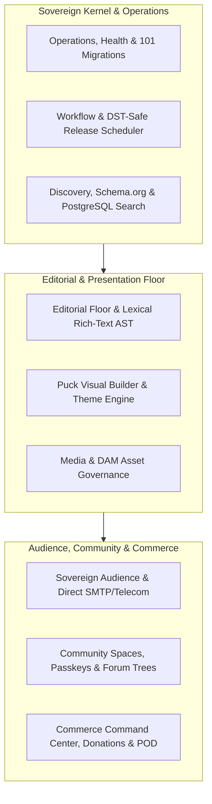

<div align="center">

# ⚡ Renegade CMoS

### The Sovereign Content & Media Operating System

[](docs/release/BETA_RELEASE_NOTES.md)
[](LICENSE)
[](https://github.com/mosesjgunner/Renegade-CMS/actions)
[](tsconfig.json)
[](https://nextjs.org)
[](https://payloadcms.com)
[](compose.production.yaml)

<p align="center">
  <strong>A free, self-hosted, portable platform uniting publishing, visual page building, media DAM, audience telecom, community forums, and sovereign commerce into a single lean appliance.</strong>
</p>

<p align="center">
  <a href="#-the-nine-product-surfaces">Product Surfaces</a> •
  <a href="#-quickstart-local-development">Quickstart</a> •
  <a href="#-production-deployment">Production Deployment</a> •
  <a href="#-architecture--principles">Architecture</a> •
  <a href="#-documentation">Docs</a> •
  <a href="docs/release/BETA_RELEASE_NOTES.md">Beta Release Notes</a>
</p>

---

</div>

## 🌐 Why Renegade CMoS?

Traditional web publishing has degraded into **SaaS sprawl**: a WordPress site tethered to Substack or Mailchimp for newsletters, Discourse or Circle for forums, Cloudinary or S3 for assets, Shopify or Gumroad for commerce, and Zapier to glue them together.

**Renegade CMoS is a Content & Media Operating System.** Instead of gluing ten subscriptions together with brittle webhooks, Renegade provides a single, resource-efficient appliance running on your own VPS. It requires **no Redis, Kafka, or RabbitMQ message brokers**—durable PostgreSQL queues and standalone Next.js handle everything.

---

## 🏛️ The Nine Product Surfaces

Renegade CMoS is organized into nine canonical, integrated product surfaces proven through the **SHOP-08** release gate:



| #     | Surface                               | Status            | Highlights                                                                                                                                                                                                           |
| ----- | ------------------------------------- | ----------------- | -------------------------------------------------------------------------------------------------------------------------------------------------------------------------------------------------------------------- |
| **1** | **Editorial Floor**                   | `Production Core` | Canonical document model, multi-author workflows, Lexical rich-text AST, revision history, preview tokens, and unpublishing safety guards.                                                                           |
| **2** | **Presentation & Page Builder**       | `Beta Module`     | Isolated Puck visual editor (0 byte bundle leak to public routes), custom theme tokens, layout IR schemas, global shell slots (`header`, `footer`, `announcement`, `cta`), and legacy WordPress/WXR site migrations. |
| **3** | **Media & DAM Governance**            | `Beta Module`     | Sharp responsive variant generation, interactive canvas image editor, audio/podcast ID3 metadata parser, chunked upload sessions, rights/consent governance, and tombstone lifecycle.                                |
| **4** | **Discovery & Distribution**          | `Production Core` | Native PostgreSQL `tsvector` full-text search projections, Schema.org JSON-LD graphs, auto-updating sitemaps, RSS 2.0 / JSON Feed 1.1 / ICS syndication, and 308 redirect loop prevention.                           |
| **5** | **Workflow & Scheduled Releases**     | `Production Core` | Multi-stage review queues, quality assurance gates, DST-safe worker execution, lease locking, and coordinated atomic releases.                                                                                       |
| **6** | **Audience & Sovereign Telecom**      | `Beta Module`     | Double opt-in consent lifecycle, preference centers, responsive email compilation, RFC compliant direct-to-MX SMTP transport, and quiet-hours-compliant SMS/RCS telecom emulators.                                   |
| **7** | **Community & Real-Time Interaction** | `Beta Module`     | WebAuthn passkey member authentication, privacy profiles, nested discussion trees, forum spaces, topic locking, moderation triage, and direct messaging with attachments.                                            |
| **8** | **Commerce Command Center**           | `Beta Module`     | Server-authoritative totals, cart tamper-proofing, deterministic payment webhooks, subscription dunning, donation anonymity walls, affiliate referral tracking, and POD preflight.                                   |
| **9** | **Operations, Backup & Restore**      | `Production Core` | 101/101 fresh database migrations, upgrade migration rehearsal, maintenance windows, isolated backup manifest generation, and cold-start restore readiness.                                                          |

---

## ⚡ Quickstart: Local Development

### Prerequisites

- **Node.js**: `20.9.0+` (Node 24 LTS recommended)
- **npm**: `10+`
- **Docker**: Engine & Docker Compose

### 1. Clone & Install

For a local all-modules verification, create a **new disposable PostgreSQL database**,
set `DATABASE_URL`, `APP_URL`, and a unique 32+ character `PAYLOAD_SECRET`, then run
`npm run db:migrate` before `npm run test:integration`. The integration command does
not migrate an empty database. `db:seed` additionally requires
`ALLOW_FIXTURE_SEED=true` and is for disposable demo data only. On Windows
PowerShell, use `npm.cmd` in place of `npm`.

```bash
git clone https://github.com/mosesjgunner/Renegade-CMS.git
cd Renegade-CMS
npm ci
```

### 2. Configure Environment

```bash
cp .env.example .env
# Set PAYLOAD_SECRET in .env with at least 32 random characters
```

### 3. Start Database & Apply Migrations

```bash
docker compose up -d --wait
npm run db:migrate
```

### 4. Boot Dev Server & Background Worker

```bash
# Terminal 1: Next.js dev server
npm run dev

# Terminal 2: Payload background jobs worker
npm run jobs:worker
```

### 5. Complete First-Run Passkey Setup

1. Open [http://localhost:3000/setup](http://localhost:3000/setup) in your browser.
2. The terminal prints a short-lived single-use setup token.
3. Enroll your passwordless WebAuthn passkey, create your initial owner account, and save your emergency recovery codes.
4. Access the admin dashboard at [http://localhost:3000/admin](http://localhost:3000/admin).

---

## 🚀 Production Deployment

Renegade CMoS is packaged as a lightweight, production-ready Docker Compose appliance:

- `postgres`: PostgreSQL 17.6 database (isolated on private Compose network)
- `migrate`: One-shot migration runner (guarantees schema integrity before boot)
- `renegade-web`: Next.js standalone application running as unprivileged `nextjs` user
- `renegade-worker`: Durable background scheduler and asynchronous jobs processor

### Production Setup (Standard or Lean VPS)

```bash
# 1. Copy production configuration
cp .env.production.example .env.production

# 2. Generate cryptographically strong secrets
# Replace POSTGRES_PASSWORD and PAYLOAD_SECRET in .env.production with random values
# Set APP_URL to your public HTTPS origin (e.g. https://cms.example.com)

# 3. Launch the containerized appliance
docker compose --project-name renegade-cms --env-file .env.production -f compose.production.yaml up --build -d --wait
```

### One-Command VPS Installer

On a fresh Linux VPS (Ubuntu/Debian), use the official bootstrap script:

```bash
./install.sh --instance renegadeparty --app-url https://cms.example.com --profile Standard
```

_Use `--profile Lean` for 1 GB RAM virtual servers or `--profile Standard` for 2 GB+ servers._

---

## 🛡️ Truthful Provider Architecture

Renegade CMoS follows a strict **sovereign-first** architectural invariant: **no feature requires external SaaS accounts to operate safely**.

```
┌────────────────────────────────────────────────────────┐
│                   Renegade CMoS Core                   │
│  (Database, Editorial, Presentation, Media, Security)  │
└───────────────────────────┬────────────────────────────┘
                            │
        ┌───────────────────┴───────────────────┐
        ▼                                       ▼
  [Local Default]                       [Connected Provider]
  • Direct RFC SMTP Mail Sink           • Twilio Telecom SMS/RCS
  • SMS / RCS Quiet-Hours Emulator      • Stripe Payments Webhooks
  • Native Web3 Crypto Ledger           • Printful / Printify POD
  • Local Persistent Disk Storage       • S3 / R2 Object Storage
```

Every external provider integration degrades gracefully to an in-memory emulator, local sink, or non-mutating preflight when credentials are unconfigured.

---

## 🧪 Verification & Quality Standards

Every release candidate is subjected to strict verification before tagging:

```bash
# Static analysis & formatting
npm run typecheck            # TypeScript strict (0 errors)
npm run lint                 # ESLint 9 (0 errors, 0 warnings)
npm run format:check         # Prettier compliance (100%)

# Test suites
npm run test                 # Unit test suite (147 test files, 983 tests passed)
npm run test:integration     # Integration suite with live PostgreSQL 17
npm run verify:presentation-bundles  # Proof of 0 Puck bundle leaks to public routes

# Database migration gates
npm run test:migrations:fresh    # 101/101 fresh migration verification
npm run test:migrations:upgrade  # Non-destructive upgrade migration rehearsal
```

---

## 📂 Repository Structure

```
Renegade-CMS/
├── src/
│   ├── app/                 # Next.js App Router (frontend, admin, API routes)
│   ├── collections/         # Payload CMS collections (Sites, Articles, Media, etc.)
│   ├── modules/             # Sovereign feature domains
│   │   ├── admin/           # Unified Admin Command Centers
│   │   ├── audience/        # Newsletter compiler, double opt-in, SMTP transport
│   │   ├── commerce/        # Server-authoritative carts, webhooks, POD, referrals
│   │   ├── community/       # Member passkeys, forums, comment trees, direct messages
│   │   ├── discovery/       # Search projections, Schema.org, sitemaps, RSS feeds
│   │   ├── editorial/       # Multi-author editorial floor & review pipelines
│   │   ├── media/           # Sharp variant generator, canvas editor, DAM governance
│   │   ├── presentation/    # Puck visual builder, design tokens, theme packages
│   │   └── workflow/        # DST-safe scheduling engine & distributed lease locks
│   └── migrations/          # 101 versioned database migrations
├── compose.production.yaml  # Production Docker Compose specification
├── install.sh               # Autonomous VPS installation & verification script
├── docs/                    # Architectural decision records, release runbooks & guides
│   ├── release/             # Beta release notes & verification reports
│   └── execution/           # SHOP-08 and nine-surface empirical evidence
└── tests/                   # Unit, integration, smoke, and Playwright browser suites
```

---

## 📚 Documentation Index

- **[Beta Release Notes & Runbook](docs/release/BETA_RELEASE_NOTES.md)**: Release tiers, provider matrices, and operator launch guide.
- **[Production Deployment](docs/PRODUCTION_DEPLOYMENT.md)**: Complete guide to VPS deployment, multi-instance setups, and reverse proxy configuration.
- **[Operational Backup & Restore](docs/OPERATIONAL_BACKUP.md)**: Zero-data-loss backup manifests and cold-start disaster recovery rehearsals.
- **[Project State & Audit Ledger](PROJECT_STATE.md)**: Chronological verification audit and proof history.

---

## 🤝 Contributing

We welcome contributions from developers, designers, and open-source advocates. Please review our [Contributing Guidelines](CONTRIBUTING.md) and [Security Policy](SECURITY.md) before opening a pull request.

---

## 📄 License

Renegade CMoS is free software licensed under the **GNU Affero General Public License v3.0 or later** ([AGPL-3.0-or-later](LICENSE)).
