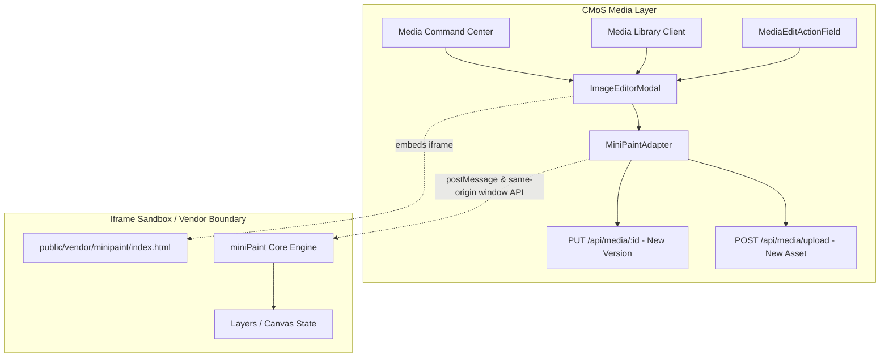

# MED-EXT-01: miniPaint Image Editor Architecture & Integration

## 1. Executive Summary

This architecture note outlines the integration of [miniPaint](https://github.com/viliusle/miniPaint) into Renegade CMoS as the native browser-based image editor for media management. The integration satisfies the following core architectural constraints:

1. **Zero Media Subsystem Duplication**: Reuses existing asset storage, permissions, versioning (`media-asset-versions`), derivatives/variants, and Media APIs (`PUT /api/media/:id`, `POST /api/media/upload`, `GET /media/:id`).
2. **Clean Component & Adapter Boundary**: The editor is mediated through the `ImageEditorAdapter` interface (`src/modules/media/image-editor/contracts.ts`), decoupling CMoS UI from miniPaint's internal APIs.
3. **Upstream Isolation & Vendoring**: Vendored strictly as static browser assets under `public/vendor/minipaint/` with MIT attribution preserved, ensuring miniPaint can be updated, patched, or swapped without refactoring CMoS.
4. **Storage & Server Agnosticism**: Functions purely in the client browser, exporting standard Web standard `Blob` and `FormData` payloads to existing CMoS endpoints regardless of whether storage is local disk, S3, or GCS.
5. **Forward Compatibility**: Explicit extension points defined for future AI operations (in-painting, generative layer insertion, background removal).

---

## 2. Integration Boundary



### Component Structure

- `src/modules/media/image-editor/contracts.ts`:
  - `ImageEditorAsset`: Canonical CMoS asset representation required by editors (`id`, `title`, `url`, `mimeType`, `width`, `height`).
  - `ImageEditorAdapter`: Standard contract for image editing engines (`initialize`, `loadImage`, `exportImage`, `getProjectData`, `loadProjectData`, `insertLayer`, `destroy`).
  - `ImageEditorSavePayload`: Payload containing file blob, export format (`png` | `jpeg` | `webp`), title, alt text, reason for change, and save mode.
- `src/modules/media/image-editor/minipaint-adapter.ts`:
  - Concrete implementation of `ImageEditorAdapter` targeting miniPaint.
  - Communicates with miniPaint via both direct window bridge (`window.Layers`, `window.app.State`, `window.app.Actions`, `window.FileSave`) and bidirectional `postMessage` messaging.
- `src/modules/media/image-editor/ImageEditorModal.tsx`:
  - Modal host providing CMoS controls: Save Mode toggle (**New Version** vs. **New Standalone Asset**), export format selection, quality slider, title/reason inputs, status indicators, and iframe container.
- `src/modules/media/image-editor/index.ts`:
  - Public export barrel for the module.

---

## 3. Asset Loading Flow

When a user initiates "Edit Image" from the Media Command Center table, detail inspector, Media Library grid, or Collection detail view:

1. **Asset Selection**:
   The host component identifies the target asset (`id`, `title`, `mimeType`, `dimensions`).
2. **URL Resolution**:
   If the asset already has an absolute or relative URL (`url` or `/media/:id`), it is resolved. If the URL points directly to `/media/:id`, the existing CMoS Media Delivery Route streams the file with appropriate MIME headers and range support.
3. **Iframe Initialization**:
   `ImageEditorModal` renders `<iframe src="/vendor/minipaint/index.html" />`.
4. **Handshake & Ready Event**:
   When miniPaint finishes booting its canvas and DOM, it fires `minipaint:ready` to `window.parent`. The adapter also polls the iframe `window.Layers` state for immediate fallback.
5. **Layer Population**:
   The adapter invokes `adapter.loadImage(asset.url, asset.title)`:
   - Fetches the image as an `HTMLImageElement`.
   - Clears default miniPaint placeholder layers.
   - Dispatches `app.Actions.insert_layer({ name: asset.title, data: img })`.
   - Adjusts canvas dimensions (`app.Actions.set_canvas_size(width, height)`) to match the source asset.
   - Refreshes GUI components and zoom level to fit workspace.

---

## 4. Save & Versioning Flow

The editor supports two non-destructive workflows governed by existing CMoS media pipelines:

### Mode A: Create New Version (`replaceMedia` / `PUT /api/media/:id`)

- **Use Case**: Editorial adjustments, cropping, or enhancements intended to supersede the active version of the existing asset while retaining all relationships across books, articles, and pages.
- **Pipeline**:
  1. miniPaint merges active visible layers onto an export canvas.
  2. Canvas converts to `Blob` (`image/png`, `image/jpeg`, or `image/webp`).
  3. Form data is assembled: `file`, `reason` (e.g., `"Cropped in miniPaint"`), `title`, and `alt`.
  4. Dispatched to `PUT /api/media/:id` with multipart/form-data.
  5. CMoS workflow (`replaceMedia` in `src/modules/media/workflow.ts`):
     - Archives the previous file to `media-asset-versions`.
     - Updates `media-assets` record with new storage file, dimensions, and hash.
     - Triggers automated variant regeneration (`thumbnail`, `preview`, `large`, `webp`, `avif`).
     - Re-indexes metadata in search indices.

### Mode B: Create New Asset (`uploadMedia` / `POST /api/media/upload`)

- **Use Case**: Creating a derived or entirely new graphic document without modifying or versioning the source asset.
- **Pipeline**:
  1. miniPaint renders canvas to `Blob`.
  2. Form data is assembled: `file`, `title` (e.g., `"My Image (Edited)"`), `alt`, and `folderId`.
  3. Dispatched to `POST /api/media/upload`.
  4. CMoS creates a fresh `media-assets` record and schedules background variant generation.

---

## 5. Upstream miniPaint Isolation

To safeguard CMoS against upstream breaking changes and enable seamless future upgrades:

1. **Self-Contained Vendoring**:
   - Location: `public/vendor/minipaint/`
   - Assets:
     - `dist/bundle.js` + `dist/bundle.js.LICENSE.txt` (Webpack build bundling all JS & CSS dependencies).
     - `images/icons/` & `images/logo.svg` (UI glyphs).
     - `MIT-LICENSE.txt` (Maintains copyright attribution to Vilius Kraujutis).
     - `index.html` (Lightweight HTML shell hosting the canvas with zero external CDN dependencies).
2. **Minimal Footprint**:
   - Total vendored footprint is ~1.4 MB of static assets, served directly by Next.js static asset serving without Node.js runtime overhead.
3. **Encapsulation via `ImageEditorAdapter`**:
   - Zero miniPaint code or dependencies are imported into CMoS TypeScript source.
   - If miniPaint is replaced in the future (e.g., with a WebAssembly-based editor or Photopea-style integration), only `minipaint-adapter.ts` requires updating; `ImageEditorModal.tsx` and all media views remain untouched.
4. **Update Protocol**:
   - Documented in `public/vendor/minipaint/README.md`.
   - Upstream upgrades only require compiling `npm run build` in upstream miniPaint and copying `dist/bundle.js` and updated icons.

---

## 6. Extension Points for Future AI Tools

The architecture reserves clean entry points for AI generative operations without pre-implementing or coupling external AI services prematurely:

```typescript
export interface ImageEditorAdapter {
  // Existing baseline methods
  initialize(container: HTMLElement | HTMLIFrameElement): Promise<void>
  loadImage(url: string, name?: string): Promise<void>
  exportImage(format: ImageEditorFormat, quality?: number): Promise<ImageEditorExportResult>
  getProjectData(): Promise<unknown>
  loadProjectData(data: unknown): Promise<void>
  destroy(): void

  // AI Extension Points (Ready for MED-AI-01+)
  /**
   * Inserts an AI-generated layer or mask directly into the active editing stack.
   * Enables generative fill, in-painting results, or vector mask overlays.
   */
  insertLayer?(layer: {
    name: string
    image: HTMLImageElement | ImageBitmap | ImageData | string
    x?: number
    y?: number
    opacity?: number
    blendMode?: string
  }): Promise<void>

  /**
   * Retrieves current active layer selection mask or bounding box
   * to send as context to image-generation/editing models.
   */
  getSelectionMask?(): Promise<Blob | null>
}
```

Future AI modules will consume `adapter.insertLayer()` to inject output from background-removal, upscale, or generative in-painting models directly into the multi-layer stack without destroying non-destructive layer history.
