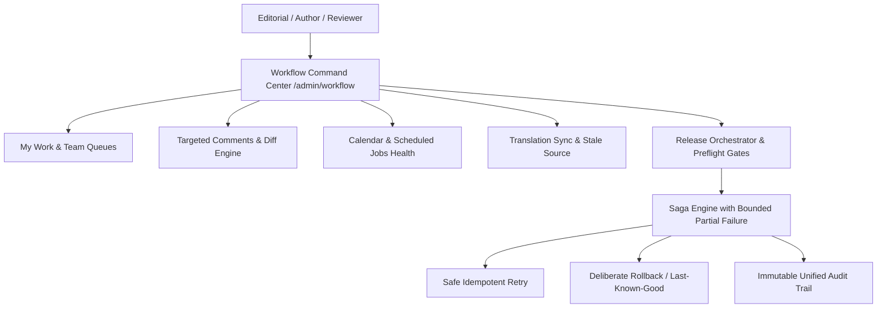

# FLOW-06: Unified Workflow Command Center & Release Governance

## Overview

FLOW-06 integrates FLOW-00 through FLOW-05 into a single, cohesive, permission-aware Workflow Command Center. It provides real-time visibility and direct-action governance from authoring through coordinated release, guaranteeing that partial failure is never hidden and human audit survives background worker restart.

## Architecture

### 1. Unified Command Center (`/admin/workflow`)

The Command Center features 11 permission-aware operational tabs:

1. **My Work**: Author assignments, revisions in draft, changes requested.
2. **Team Queues**: Filterable review pipelines (`awaiting-approval`, `in-review`, `approved`, `overdue`, `blocked`).
3. **Unresolved Comments**: Targeted review comments scoped to `body`, `media`, `seo`, or `layout` with direct context anchors.
4. **Due & Overdue**: SLA tracking with color-coded diff hours and urgency badges.
5. **Operational Calendar**: Unified timeline of scheduled publish jobs and releases.
6. **Scheduled Jobs & Worker Health**: Lease expiration tracking, worker lock state, sanitized error logs.
7. **Translations**: Stale source indicators, 7-point completeness scores, unreviewed machine draft flags.
8. **Coordinated Releases**: Pinned artifact counts, preflight gate pass/block indicators, direct orchestrator links.
9. **Blockers & Quality Issues**: Deterministic QA/SEO/a11y/rights blockers with direct repair URLs.
10. **Notification Outbox**: Failures with retry counts, channel details, and last error diagnostics.
11. **Recent Audit Stream**: Immutable unified timeline of all editorial and release operations.

### 2. Targeted Review Comments & Revision Diff Engine

- Comments are pinned to exact revisions ($N$) and targeted to specific elements (`body`, `media`, `seo`, `layout`).
- Comments support `addressed` and `resolved` lifecycle states.
- Structural diff comparisons compare two arbitrary revisions field-by-field, highlighting changes in title, summary, body, media choices, SEO metadata, and presentation layout blocks.

### 3. Approval Staleness Invariant

- When an article is approved at revision $N$, subsequent draft saves advance the revision to $N+1$.
- `CMoSWorkflowEngine` immediately marks `staleApproval = true` and invalidates approval on the pending draft.
- Scheduled jobs strictly publish target revision $N$, completely isolating unapproved revisions from public convergence.

### 4. Coordinated Release Lifecycle & Bounded Partial Failure

- Releases pin exact artifact sequences (`article`, `page`, `presentation`, `media`, `redirect`, `distribution`).
- Deterministic preflight gates evaluate permissions, dependencies, rights expiration, URL conflicts, and unresolved comments.
- Authorized role-based waivers record authorizer ID, role, rationale, and expiration instant.
- **Strict Semantic Invariant**: Partial execution in a release saga is **never labeled completed**. Failing non-fatal or external steps transition the release to `partially-failed`.
- Operators can safely perform **idempotent retry** (resuming only pending/failed steps) or **deliberate rollback** (restoring last-known-good state, disabling redirects, purging CDN, and preserving full audit logs).

## Verification

- Unit Test Suite: `tests/unit/flow-06-command-center.test.ts` (3/3 PASS)
- Integration Test Suite: `tests/integration/flow-06-workflow-pass-gate.integration.test.ts` (1/1 multi-stage PASS)
- Total Workflow Suite: 10 test files passed / 67 tests passed
- Production Build: 63/63 static & dynamic routes compiled cleanly (`npm run build`)
- Typecheck: 0 errors (`tsc --noEmit`)
