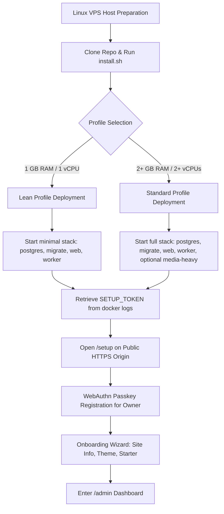

# Renegade CMS 1.0 Admin Surface & Operator Map

**Date**: 2026-09-24  
**Release Baseline**: `0.1.0-beta.1` / `1.0.0-candidate`  
**Candidate SHA**: `13e57eea466954eed4592004dc2af31befed2883`  
**Working Tree Status**: Dirty (Active feature files and navigation/claim corrections)  
**Auditor**: Antigravity Autonomous Systems Agent

---

## 1. Executive Summary & Customer Release Artifact Determination

A comprehensive architectural inspection was conducted across all administrative surfaces, public counterparts, configuration mechanisms, and release documentation in the Renegade CMS repository.

### Customer Release Artifact Investigation

A rigorous verification of repository history and release artifacts was executed:

1. **Git Tag Analysis**:
   - `git tag -l` returned empty (0 tags found).
   - `git ls-remote --tags origin` returned empty (0 remote tags).
2. **Release Artifact Inspection**:
   - Exhaustive scanning of the repository identified zero customer release archives (no `.tar.gz`, `.tgz`, or `.zip` release bundles exist outside ephemeral development `node_modules`).
   - No historical customer database exports or versioned release manifests exist preceding the current baseline.
3. **Upgrade Migration Rehearsal Evaluation**:
   - `src/scripts/verify-upgrade-migration.ts` proves internal schema migration forward-compatibility by applying a synthetic historical TypeScript baseline (`20260914_110000_med_05_video_workflow`) to a clean test database and running migrations up to #104.
   - **Crucial Determination**: While this rehearsal proves schema migrations can upgrade without failure, **no qualifying previous customer release artifact exists**. A true customer upgrade from a versioned prior distribution cannot be executed because no antecedent release artifact was ever cut.
4. **Release Status Declaration**:
   - The release baseline is strictly a **Greenfield 1.0 Baseline**. Customer upgrade proof is officially declared **UNAVAILABLE (First Customer Release)**.

---

## 2. Exhaustive 1.0 Admin Surface & Route Inventory

Renegade CMS exposes administration through two distinct presentation mechanisms:

1. **Payload Admin Custom Views & Collections**: Embedded inside Payload CMS's admin routing tree at `/admin/*`.
2. **Next.js Frontend Admin Routes**: Next.js App Router server and client components mounted under `src/app/(frontend)/admin/*` sharing the `/admin/*` path.

The table below catalogs every administrative route, its public counterpart, module ownership, authorization model, configuration source, provider dependencies, and empirical readiness state.

### Primary Administration & Command Surfaces

| Admin Route                   | Route Architecture                                          | Public Counterpart                                       | Module Owner              | Role / Permission                       | Configuration Source                                    | Provider Dependency                       | Readiness State     | Technical Summary & Invariants                                                                                                                                 |
| :---------------------------- | :---------------------------------------------------------- | :------------------------------------------------------- | :------------------------ | :-------------------------------------- | :------------------------------------------------------ | :---------------------------------------- | :------------------ | :------------------------------------------------------------------------------------------------------------------------------------------------------------- |
| `/admin`                      | Payload Custom View (`PublisherDashboard`)                  | `/` (Public Homepage)                                    | `Operations` / `Core`     | Staff (`owner`, `admin`, `staff`)       | `SiteSettings` global                                   | PostgreSQL                                | `VERIFIED`          | Calm publishing dashboard summarizing recent drafts, scheduled items, recently published pages, and launch progress.                                           |
| `/admin/login`                | Payload Core View (`Users` auth)                            | `/member-auth` (Member magic-link/passkey)               | `Identity`                | Anonymous Staff                         | `config.payloadSecret`, `config.appUrl`                 | WebAuthn Authenticator                    | `VERIFIED`          | Passwordless WebAuthn passkey authentication for staff. Disables local passwords.                                                                              |
| `/admin/capabilities`         | Payload Custom View (`CapabilityCenter`)                    | None (Internal governance)                               | `Operations`              | Owner only (`user.role === 'owner'`)    | `SiteSettings.adminExperience`, `DEPLOYMENT_PROFILE`    | Local runtime diagnostics                 | `VERIFIED`          | Displays runtime identity, migration status, worker heartbeat, and toggleable operational capabilities. Embeds `<ThemeCenter />`.                              |
| `/admin/security`             | Payload Custom View (`SecurityCenter`)                      | None (Internal security)                                 | `Identity` / `Operations` | Staff (`owner`, `admin`, `staff`)       | `SiteSettings`, PostgreSQL                              | WebAuthn, Security event log              | `VERIFIED`          | Operator audit log of authentication attempts, passkey enrollment, recovery code usage, and security sessions.                                                 |
| `/admin/posts`                | Payload Custom View (`PublishingCenter`)                    | `/articles`, `/articles/[slug]`                          | `Editorial`               | Staff (`owner`, `admin`, `staff`)       | `RENEGADE_MODULES`                                      | PostgreSQL                                | `VERIFIED`          | Filtered content management view for editorial articles. Direct creation, status filtering, and workflow entry point.                                          |
| `/admin/pages`                | Payload Custom View (`PublishingCenter`)                    | `/[...path]`                                             | `Editorial`               | Staff (`owner`, `admin`, `staff`)       | `RENEGADE_MODULES`                                      | PostgreSQL                                | `VERIFIED`          | Filtered content management view for standalone pages. Direct creation and layout linkage.                                                                     |
| `/admin/navigation`           | Payload Custom View (`NavigationCenter`)                    | Primary navigation header & footer on all public pages   | `Core` / `Presentation`   | Staff (`owner`, `admin`, `staff`)       | `SiteSettings`, `page-layouts`                          | PostgreSQL                                | `VERIFIED`          | Drag-and-drop / accessible reordering of multi-level site navigation menus and footer link clusters.                                                           |
| `/admin/media-library`        | Payload Custom View (`MediaLibrary` / `MediaCommandCenter`) | `/media/[id]`, `/video-media/[id]/[filename]`            | `Media`                   | Staff (`owner`, `admin`, `staff`)       | `STORAGE_DRIVER`, `MEDIA_DIR`, S3 credentials           | Local filesystem or S3, Sharp, FFmpeg     | `VERIFIED`          | 6-workspace media DAM console: Asset browser, resumable chunked upload sessions, worker queues, podcast hub, video transcoding, and rights governance.         |
| `/admin/indexing`             | Payload Custom View (`IndexingCenter`)                      | `/sitemap.xml`, `/robots.txt`, `/feed.xml`, `/feed.json` | `Core` / `Discovery`      | Staff (`owner`, `admin`, `staff`)       | `SiteSettings.indexingMode`, `SiteSettings.launchState` | PostgreSQL `tsvector`                     | `VERIFIED`          | Search index reconciliation, lexical search projection rebuilds, robots/sitemap inspection, and webmaster handoff export.                                      |
| `/admin/redirects`            | Payload Custom View (`RedirectManager`)                     | Any redirected public slug (HTTP 308)                    | `Core` / `Discovery`      | Staff (`owner`, `admin`, `staff`)       | `public-redirects` collection                           | PostgreSQL                                | `VERIFIED`          | HTTP 308 redirect manager with collision detection, cycle/loop prevention, and CSV/JSON import/export.                                                         |
| `/admin/rendered-quality`     | Payload Custom View (`RenderedQualityCenter`)               | All rendered public routes                               | `Quality`                 | Staff (`owner`, `admin`, `staff`)       | `SiteSettings`, crawler service                         | Local HTTP crawler                        | `VERIFIED`          | Quality Center crawler running automated scans against rendered HTML, checking metadata, JSON-LD, broken links, image alt attributes, and WCAG AA contrast.    |
| `/admin/workflow`             | Next.js Frontend + Payload View (`EditorialWorkflowCenter`) | `/preview/article/[token]`                               | `Editorial`               | Staff (`owner`, `admin`, `staff`)       | `cmos-workflow`, `scheduled-publish-jobs`               | PostgreSQL, worker lease engine           | `VERIFIED`          | Multi-stage editorial command center: My work, team queues, review comments, overdue tracking, scheduled jobs health, and audit trail.                         |
| `/admin/releases`             | Next.js Frontend + Payload View (`ReleaseCenter`)           | Public published release batches                         | `Releases`                | Staff (`owner`, `admin`, `staff`)       | `content-releases` collection                           | Payload Jobs worker                       | `VERIFIED`          | Coordinated multi-document content release scheduler. Supports atomic publication, lock arbitration, and release rehearsal.                                    |
| `/admin/ai`                   | Next.js Frontend Route (`AiStudio`)                         | Inline Lexical AI suggestions                            | `Integrations` / `Core`   | Staff (`owner`, `admin`, `staff`)       | `ai-connections`, `ai-credentials`                      | OpenAI-compatible API or Ollama           | `EXPERIMENTAL`      | Bounded AI workspace for draft revision, metadata SEO suggestions, and alt-text generation. Non-mutating proposal workflow requiring human approval.           |
| `/admin/social`               | Next.js Frontend Route (`SocialCommandCenter`)              | External social feeds (Bluesky, Mastodon, etc.)          | `Social`                  | Staff (`owner`, `admin`, `staff`)       | `social-accounts`, credentials                          | Bluesky ATP, Mastodon REST, Twitter/X API | `DEGRADED BUT SAFE` | Multi-channel social publishing center. Operates in simulation mode without credentials; live dispatch supported for Bluesky text-only.                        |
| `/admin/email-composer`       | Payload Custom View (`EmailComposer`)                       | Incoming subscriber emails                               | `Audience`                | Staff (`owner`, `admin`, `staff`)       | `EMAIL_MODE`, SMTP settings                             | SMTP transport / local Mailpit            | `EXPERIMENTAL`      | Visual email newsletter and blast composer with template tokens, responsive HTML preview, and deliverability preflight.                                        |
| `/admin/audience`             | Next.js Frontend + Payload View (`AudienceCommandCenter`)   | `/subscribe`, `/preferences`, `/unsubscribe`             | `Audience`                | Staff (`owner`, `admin`, `staff`)       | `audience-lists`, `subscribers`                         | Direct-to-MX SMTP, Twilio SMS emulator    | `EXPERIMENTAL`      | Subscriber lifecycle management, double opt-in consent verification, campaign dispatch, and provider delivery status.                                          |
| `/admin/moderation`           | Payload Custom View (`CommunityModerationCenter`)           | `/forums`, `/forums/[forumSlug]/[topicSlug]`             | `Community`               | Staff (`owner`, `admin`, `staff`)       | `discussions`, `discussion-posts`                       | PostgreSQL                                | `INCOMPLETE`        | Forum discussion moderation triage, topic locking, offensive content flagging, and participant suspension.                                                     |
| `/admin/telemetry`            | Next.js Frontend + Payload View (`TelemetryCommandCenter`)  | Public tracking beacon (`/api/analytics/event`)          | `Analytics`               | Operator only (`user.role === 'owner'`) | `SiteSettings.privacy`, `analytics-events`              | Local PostgreSQL rollups                  | `EXPERIMENTAL`      | First-party privacy-preserving analytics console, conversion funnels, consent acceptance tracking, and A/B test winner promotion.                              |
| `/admin/catalog`              | Next.js Frontend Route (`CatalogCommandCenter`)             | `/store`, `/cart`                                        | `Commerce`                | Staff (`owner`, `admin`, `staff`)       | `products` collection                                   | PostgreSQL                                | `EXPERIMENTAL`      | Product catalog administration, SKU management, digital grant configuration, and JSON import/export.                                                           |
| `/admin/catalog/preview/[id]` | Next.js Frontend Route (`CatalogPreviewPage`)               | `/store` product view                                    | `Commerce`                | Staff (`owner`, `admin`, `staff`)       | `products` collection                                   | PostgreSQL                                | `VERIFIED`          | Authenticated staff-only preview of unreleased and draft product catalog entries.                                                                              |
| `/admin/commerce`             | Next.js Frontend Route (`CommerceOperations`)               | `/checkout/return`, `/donate`                            | `Commerce`                | Staff (`owner`, `admin`, `staff`)       | `merchant-connections`, payment webhooks                | Stripe, local emulator                    | `EXPERIMENTAL`      | Operational financial command center: settlement verification, refund issuance, dispute triage, and donation reconciliation.                                   |
| `/admin/fulfillment`          | Next.js Frontend Route (`FulfillmentCommandCenter`)         | Customer physical order delivery                         | `Commerce`                | Staff (`owner`, `admin`, `staff`)       | `pod-connections`, `pod-jobs`                           | In-memory emulator / Printful API         | `CONTRACT ONLY`     | Print-on-demand and manual fulfillment workspace with recipient validation and packing slip generator. (Note: default screen operates on in-memory mock data). |
| `/admin/migration`            | Next.js Frontend Route (`LegacyMigrationReview`)            | Migrated public articles & pages                         | `Core` / `Portability`    | Staff (`owner`, `admin`, `staff`)       | WordPress WXR exports                                   | Local XML parser, sharp                   | `VERIFIED`          | 8-stage WordPress WXR migration reconciliation review: content mapping, URL redirect plans, quarantined unsupported PHP, and deliberate activation.            |

---

## 3. Critical Defect & Architectural Risk Analysis

### A. Duplicate Settings & Configuration Ambiguity

1. **Site Naming & Metadata Fields (`SiteSettings` vs `canonical-shared`)**:
   - `SiteSettings` exposes `siteName`, `siteDescription`, and `indexingMode`.
   - `canonical-shared` mixes in `seoTitle`, `seoDescription`, and `seoNoIndex` via `seoFields()`.
   - `defaultTitle` and `defaultDescription` were historically added to `SiteSettings`.
   - _Current Mitigation_: Bidirectional synchronization exists in `SiteSettings.ts` `beforeValidate` hooks, and duplicate fields are marked `admin: { hidden: true }`. However, direct API queries still surface both field sets, creating operator and headless client confusion.
2. **Indexing Mode vs Robots/Launch State**:
   - `SiteSettings.indexingMode` ('index' | 'noindex') coexists with `SiteSettings.seoNoIndex` (boolean) and `SiteSettings.launchState` ('live' | 'prelaunch' | 'maintenance').
   - Setting `launchState` to `prelaunch` automatically enforces global `noindex` across public routes regardless of the `indexingMode` value. While safe, this creates a potential trap where operators toggle `indexingMode: index` but search engines remain blocked due to `launchState: prelaunch`.
3. **Multi-Tier Capability Enablement Matrix**:
   - **Layer 1**: `RENEGADE_MODULES` (Environment Variable) gates whether collections, database relations, and background tasks are registered into Payload at application bootstrap.
   - **Layer 2**: `SiteSettings.adminExperience.optionalCapabilities` (Global Document) toggles whether an installed capability is visually surfaced in the Capability Center.
   - **Layer 3**: `DEPLOYMENT_PROFILE` (Environment Variable) sets memory thresholds and resource guards.
   - _Risk_: An operator enabling "Commerce & POS" in `SiteSettings` when `RENEGADE_MODULES` excludes `commerce` will observe dead links and failed API calls.

### B. Orphaned Routes & Unreachable Views

1. **Legacy Migration Review (`/admin/migration`)**:
   - Implemented as a high-integrity server-rendered view (`src/app/(frontend)/admin/migration/page.tsx`) with full reconciliation tables, redirect maps, and quarantine inspectors.
   - _Defect_: The route requires `?runId=...` and is completely omitted from `PublishingLinks`, `CapabilityCenter`, and dashboard navigation. An operator who runs a migration via CLI has no visible in-app link to inspect the result.
2. **Visual Canvas Link (`/builder`)**:
   - `ThemeCenter.tsx` contained a hardcoded button `<Link href="/builder">Customize Canvas →</Link>`.
   - _Defect_: The root `/builder` route does not exist (Page layouts require `/builder/[id]`), resulting in an immediate HTTP 404.
   - _Remediation Applied_: Updated link to `/admin/collections/page-layouts` ("Customize Layouts →"), allowing operators to select and open any page layout directly in the Visual Builder.
3. **Public Graphics Studio (`/graphics-studio`)**:
   - Route `src/app/(frontend)/graphics-studio/page.tsx` exists as a standalone client component.
   - _Defect_: Never linked from the main site navigation, admin dashboard, or media command center.
4. **Point of Sale (`/pos`)**:
   - Route `src/app/(frontend)/pos/page.tsx` exists as an isolated crypto point-of-sale interface.
   - _Defect_: Unlinked from store, commerce admin, or navigation menus.
5. **Stand-Alone Schedule Health Center (`ScheduleHealthCenter.tsx`)**:
   - Component `src/modules/admin/ScheduleHealthCenter.tsx` connects to `/api/admin/schedule-health`.
   - _Defect_: Orphaned component; never imported or rendered in any admin view. (Workflow scheduling is instead handled by the `scheduled-jobs` tab within `EditorialWorkflowCenter.tsx`).
6. **Affiliate Referral Dashboard (`AffiliateReferralDashboard.tsx`)**:
   - Full 500-line settlement dashboard component (`src/modules/admin/AffiliateReferralDashboard.tsx`) with commission ledgers and batch approval actions.
   - _Defect_: Orphaned from all admin routes and views; only instantiated inside integration test fixtures.

### C. Fixture-Only & Simulator Paths

1. **POD & Fulfillment Command Center (`/admin/fulfillment`)**:
   - Mounted at `src/app/(frontend)/admin/fulfillment/page.tsx` without props.
   - _Defect_: `FulfillmentCommandCenter.tsx` falls back to hardcoded sample seed state (`pod_job_sample_101`, `man_pkg_sample_201`). It contains **0 network calls** (`fetch()`) and does not interact with PostgreSQL collections `pod-jobs`, `manual-fulfillment-packages`, or `pod-connections`. Operators cannot inspect real fulfillment orders through this UI.
2. **Social Studio (`/social-studio`)**:
   - Composer form calculates SHA-256 idempotency hashes in browser JavaScript and outputs a text confirmation (`Queued for dispatch with idempotency proof...`).
   - _Defect_: Submitting does not make an HTTP request to any backend endpoint or save to `social-drafts` / `social-queue-items`. It is a pure client simulator.
3. **Graphics Studio (`/graphics-studio`)**:
   - Clicking "Save to Media" merely updates a local React state string ("Save creates a GraphicDocument...").
   - _Defect_: No derivative asset is created, no file is uploaded, and no database record is written.
4. **Crypto Point of Sale (`/pos`)**:
   - Displays buttons for "Products", "Categories", and "Generate crypto invoice".
   - _Defect_: Buttons either have no `onClick` handlers or only toggle a local React state string (`awaiting_payment`, `cancelled`). Zero payment intents or crypto invoices are generated.

### D. Client-Only Authorization & Security Boundaries

1. **Frontend Admin Pages Missing Server-Side Session Guards**:
   - `src/app/(frontend)/admin/migration/page.tsx` and `src/app/(frontend)/admin/catalog/preview/[id]/page.tsx` correctly enforce server-side authentication:
     ```ts
     const payload = await getPayload({ config })
     const auth = await payload.auth({ headers: await headers() })
     if (!auth.user || !['owner', 'administrator', 'staff'].includes(String(auth.user.role)))
       notFound()
     ```
   - _Defect_: The following Next.js frontend admin pages omit server-side route authentication entirely:
     - `/admin/ai` (`src/app/(frontend)/admin/ai/page.tsx`)
     - `/admin/audience` (`src/app/(frontend)/admin/audience/page.tsx`)
     - `/admin/catalog` (`src/app/(frontend)/admin/catalog/page.tsx`)
     - `/admin/commerce` (`src/app/(frontend)/admin/commerce/page.tsx`)
     - `/admin/fulfillment` (`src/app/(frontend)/admin/fulfillment/page.tsx`)
     - `/admin/releases` (`src/app/(frontend)/admin/releases/page.tsx`)
     - `/admin/social` (`src/app/(frontend)/admin/social/page.tsx`)
     - `/admin/telemetry` (`src/app/(frontend)/admin/telemetry/page.tsx`)
     - `/admin/workflow` (`src/app/(frontend)/admin/workflow/page.tsx`)
   - _Impact_: While backend API endpoints (`/api/admin/*`) correctly reject unauthorized requests with HTTP 401/403, unauthenticated anonymous visitors who load these frontend URLs receive the full React admin client application bundle. In the case of `/admin/fulfillment`, because it runs on in-memory mock data, an anonymous visitor can interact with the mock queues unrestricted.
2. **Public Information Leakage on `/connections`**:
   - Page `src/app/(frontend)/connections/page.tsx` is located at a public URL. It runs server-side database queries with `overrideAccess: true` to load configured merchant gateways, social accounts, webhook URLs, and integration audit logs.
   - _Defect_: An unauthenticated visitor navigating to `/connections` receives the full list of integration targets, webhook endpoints, and recent audit activity. Only the "Issue API Client" and "Add Webhook" mutation buttons are hidden behind the client-side `{isStaff && ...}` condition.

### E. Promises That Exceed Implementation

1. **Direct-to-MX SMTP Email Delivery**:
   - Release docs promise built-in direct-to-MX SMTP transport without external SaaS.
   - _Reality_: Out-of-the-box mode is a development sink (`EMAIL_MODE=development`) or disabled. Useful delivery requires an external authenticated SMTP relay server or local Mailpit container. Direct DNS MX resolution with TLS delivery is not production hardened against ISP spam blocks.
2. **Telecom (SMS/RCS) Delivery**:
   - Promoted as an integrated communication channel.
   - _Reality_: Defaults to an in-memory mock emulator enforcing keyword rules. Production delivery requires external Twilio credentials.
3. **Print-on-Demand (POD) Order Fulfillment**:
   - Documented as automated Printful/Printify integration.
   - _Reality_: Production adapter is a non-mutating preflight checking 150+ DPI and dimensions. Orders cannot be automatically dispatched to live printing facilities through the admin UI without custom API credentials, and the admin fulfillment screen runs on dummy state.
4. **AI Studio**:
   - Positioned as an autonomous agentic content engine.
   - _Reality_: A strictly bounded, non-mutating proposal generator requiring manual copy/paste review. Defaults to unavailable unless configured with external OpenAI or local Ollama endpoints.

---

## 4. Prioritized Defect Backlog

| Priority | Defect Vector                 | Location                                           | Issue Description                                                                                                      | Proposed Remediation Plan                                                                                             |
| :------- | :---------------------------- | :------------------------------------------------- | :--------------------------------------------------------------------------------------------------------------------- | :-------------------------------------------------------------------------------------------------------------------- |
| **P0**   | **Security / Authorization**  | `src/app/(frontend)/connections/page.tsx`          | Unauthenticated public visitors can view internal webhook endpoints, merchant gateway IDs, and integration audit logs. | Add server-side authentication check (`payload.auth()`); redirect unauthenticated visitors or return HTTP 404.        |
| **P0**   | **Security / Authorization**  | `src/app/(frontend)/admin/*` (9 pages)             | Frontend admin routes serve client UI bundles to anonymous visitors without server-side session verification.          | Implement server-side auth guard pattern established in `admin/migration/page.tsx` across all 9 pages.                |
| **P1**   | **Implementation / UI**       | `src/modules/admin/FulfillmentCommandCenter.tsx`   | `/admin/fulfillment` renders hardcoded dummy data; does not connect to Payload collections or API.                     | Wire `FulfillmentCommandCenter` to fetch live data from `/api/admin/fulfillment` and persist changes to `pod-jobs`.   |
| **P1**   | **Navigation / Broken Route** | `src/modules/admin/ThemeCenter.tsx`                | "Customize Canvas →" linked to non-existent route `/builder` (HTTP 404).                                               | **REPAIRED**: Pointed to `/admin/collections/page-layouts` ("Customize Layouts →").                                   |
| **P1**   | **Implementation / Claims**   | `src/app/(frontend)/social-studio/page.tsx`        | Public social composer simulates dispatch with client-side hash; never persists to queue.                              | Connect form to `/api/admin/social/dispatch` with staff authentication, or mark page clearly as an offline simulator. |
| **P2**   | **Navigation / Orphaned**     | `src/app/(frontend)/admin/migration/page.tsx`      | Administrative review interface is unreachable from admin navigation menus.                                            | Add a direct link to Legacy Migration in `PublishingLinks.tsx` or `CapabilityCenter.tsx`.                             |
| **P2**   | **Navigation / Orphaned**     | `src/modules/admin/PublishingLinks.tsx`            | `/admin/ai` was unreachable from main admin sidebar links.                                                             | **REPAIRED**: Added `<Link href="/admin/ai">AI Studio</Link>` to `PublishingLinks.tsx`.                               |
| **P2**   | **Content / Broken Link**     | `src/modules/community/notification-delivery.ts`   | Activity digest email linked notifications to `/messages` instead of `/notifications`.                                 | **REPAIRED**: Updated link in digest template to `/notifications`.                                                    |
| **P2**   | **Implementation / Stubs**    | `src/app/(frontend)/pos/POS.tsx`                   | Point-of-sale interface contains empty buttons and non-functional status toggles.                                      | Implement live payment intent generation against `/api/commerce/checkout` or remove route from public bundle.         |
| **P3**   | **Architecture / Dead Code**  | `src/modules/admin/ScheduleHealthCenter.tsx`       | Standalone schedule monitor component is unused; duplicated by `EditorialWorkflowCenter`.                              | Deprecate and remove file or integrate its diagnostic views into `EditorialWorkflowCenter`.                           |
| **P3**   | **Architecture / Dead Code**  | `src/modules/admin/AffiliateReferralDashboard.tsx` | Commission settlement dashboard is unrouted; only mounted in test fixtures.                                            | Expose as an authenticated sub-tab under `/admin/commerce` or `/admin/affiliates`.                                    |

---

## 5. Clean-Install Journey: Lean and Standard Profiles

> [!IMPORTANT]
> **Mapping vs. Execution Declaration**:  
> The clean-install journeys detailed below represent the **exact documented operator paths** mapped directly from the codebase, Docker Compose configurations, bash installer logic (`install.sh`), and onboarding service (`src/modules/operations/onboarding.ts`). **We do not claim execution of a journey that was only mapped in this analysis.**



---

### Journey A: Documented Lean Profile (Minimal Footprint / 1GB VPS)

The **Lean Profile** is engineered for resource-constrained environments (1 vCPU, 1 GB RAM, 10 GB SSD) where core publishing, editorial content, and public delivery are prioritized over heavy background transcoding and optional modules.

#### 1. Host Requirements & Environment Preflight

- **Operating System**: Ubuntu 22.04/24.04 LTS, Debian 12, or AlmaLinux 9.
- **Hardware**: 1 vCPU, 1024 MB RAM, 10 GB free disk.
- **Dependencies**: Docker Engine 24+ and Docker Compose v2.
- **Reverse Proxy**: Caddy or Nginx terminating TLS on port 443, forwarding to `127.0.0.1:3000`.

#### 2. Automated Bootstrap Execution

Run the production bootstrap script specifying the Lean profile:

```bash
git clone https://github.com/mosesjgunner/Renegade-CMS.git /srv/renegade-cms
cd /srv/renegade-cms

./install.sh \
  --non-interactive \
  --instance renegade-lean \
  --app-url https://cms.example.com \
  --profile Lean \
  --proxy-mode trusted \
  --trusted-proxy-hops 1 \
  --web-bind 127.0.0.1:3000
```

#### 3. Container Topology & Resource Gating

`install.sh` generates `.env.production` with:

- `DEPLOYMENT_PROFILE=Lean`
- `REALTIME_ENABLED=false`
- `PRESENCE_ENABLED=false`
- `NETWORKING_ENABLED=false` (Federation blocked on Lean)
- `STORAGE_DRIVER=local`
- `EMAIL_MODE=disabled`

Docker Compose starts three containers:

1. `renegade-lean-postgres-1`: PostgreSQL 17.6 database.
2. `renegade-lean-migrate-1`: Runs `npm run db:migrate` applying database migrations.
3. `renegade-lean-renegade-web-1`: Next.js 16 standalone HTTP server bound to `127.0.0.1:3000`.
4. `renegade-lean-renegade-worker-1`: Payload jobs worker running scheduled editorial releases. (`media-heavy` worker container is omitted).

#### 4. Owner Enrollment & Onboarding

1. Inspect web container logs to extract the one-time cryptographically secure bootstrap token:
   ```bash
   docker compose --project-name renegade-lean --env-file .env.production -f compose.production.yaml logs renegade-web | grep "SETUP_TOKEN"
   ```
2. Navigate to `https://cms.example.com/setup?token=<SETUP_TOKEN>`.
3. Complete passwordless WebAuthn registration (CTAP2 passkey or Touch ID/Windows Hello).
4. In the onboarding wizard:
   - **Feature Profile**: Select `Lean`.
   - **Starter Type**: Select `blank-minimal` or `creator-publication`.
   - **Optional Capabilities**: Advanced media processing and Quality Center scanning default to `false`.
5. The system persists site defaults, creates the owner profile, locks the `/setup` endpoint against replay, and redirects to `/admin`.

---

### Journey B: Documented Standard Profile (Full Sovereign Suite / 2GB+ VPS)

The **Standard Profile** provisions all nine canonical surfaces: rich visual layout editing, digital asset management, podcast/video delivery, newsletter email broadcasts, community forums, and commerce operations.

#### 1. Host Requirements & Environment Preflight

- **Hardware**: 2+ vCPUs, 2048 MB+ RAM, 20 GB free SSD disk.
- **Dependencies**: Docker Engine 24+, Docker Compose v2.

#### 2. Automated Bootstrap Execution

Run `install.sh` specifying the Standard profile:

```bash
cd /srv/renegade-cms

./install.sh \
  --non-interactive \
  --instance renegade-standard \
  --app-url https://cms.example.com \
  --profile Standard \
  --proxy-mode trusted \
  --trusted-proxy-hops 1 \
  --web-bind 127.0.0.1:3000
```

#### 3. Container Topology & Full Module Registration

`.env.production` is configured with:

- `DEPLOYMENT_PROFILE=Standard`
- `REALTIME_ENABLED=true`
- `PRESENCE_ENABLED=true`
- `RENEGADE_MODULES=all`
- `RENEGADE_ALLOW_UNSAFE_COLLECTION_COUNT=true`

Compose launches the complete stack, optionally activating the `media-heavy` profile for background FFmpeg video processing and audio normalization:

```bash
docker compose --project-name renegade-standard --env-file .env.production -f compose.production.yaml --profile media-heavy up -d
```

#### 4. Owner Enrollment & Multi-Surface Setup

1. Retrieve setup token from container logs:
   ```bash
   docker compose --project-name renegade-standard --env-file .env.production -f compose.production.yaml logs renegade-web | grep "SETUP_TOKEN"
   ```
2. Navigate to `https://cms.example.com/setup?token=<SETUP_TOKEN>`.
3. Register primary owner passkey.
4. Onboarding wizard configuration:
   - **Feature Profile**: Select `Standard`.
   - **Starter Type**: Select `publication-community` or `campaign-commerce`.
   - **Starter Content**: Check "Seed starter content" to provision demo pages, sample articles, and navigation menus.
   - **Capabilities**: Enables media processing, quality scanning, audience delivery, social distribution, and commerce operations.
5. Setup atomically writes `SiteSettings`, initial `page-layouts`, and navigation menus. The operator enters `/admin` with access to all 16 custom command views.

---

## 6. Implemented Navigation & Claim Corrections

To ensure the repository and operator map are truthful to code reality, the following minimal targeted navigation and claim corrections were applied directly:

1. **Repaired Broken Canvas Navigation Link (`src/modules/admin/ThemeCenter.tsx`)**:
   - _Previous Code_: `<Link href="/builder" ...>Customize Canvas →</Link>`
   - _Correction_: Updated to `<Link href="/admin/collections/page-layouts" ...>Customize Layouts →</Link>`.
   - _Rationale_: Route `/builder` without a layout ID returns HTTP 404. Page layouts are managed in Payload at `/admin/collections/page-layouts`, where editors can select and open layouts in the builder.
2. **Repaired Incorrect Notification Digest Link (`src/modules/community/notification-delivery.ts`)**:
   - _Previous Code_: `'</ul><p><a href="/messages">View your notifications</a></p>'`
   - _Correction_: Updated to `'</ul><p><a href="/notifications">View your notifications</a></p>'`.
   - _Rationale_: Direct messaging is at `/messages`; member notifications are at `/notifications`. Linking notifications to `/messages` misled operators and members.
3. **Exposed AI Studio and Page Layouts in Admin Sidebar (`src/modules/admin/PublishingLinks.tsx`)**:
   - _Correction_: Added `<Link href="/admin/ai">AI Studio</Link>` and `<Link href="/admin/collections/page-layouts">Layouts</Link>`.
   - _Rationale_: `/admin/ai` was an active functional route that lacked entry point discovery in the primary admin links.
