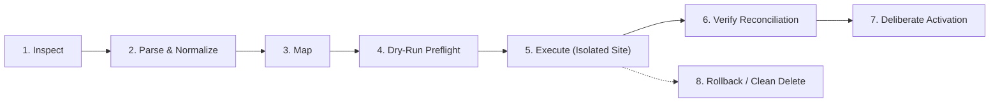

# PRE-05: Legacy Site Migration & Presentation Reconstruction

## Overview

Renegade CMS provides a safe, repeatable, and audited migration path for legacy WordPress exports (WXR) and normalized site packages. Rather than merely importing unstyled posts into an arbitrary new design, PRE-05 reconstructs both **content** and **presentation** into reviewable Renegade themes, templates, global regions, navigation menus, and public redirects—without executing untrusted legacy PHP, plugins, shortcodes, scripts, or styles inside Renegade.

Every import executes through a staged pipeline where every stage is resumable, idempotent, and produces a tamper-evident audit report.

---

## Staged Migration Pipeline

### Stage 1: Inspect
- Ingests legacy export package (WXR XML, theme mapping, or captured assets).
- Validates XML structure, calculates SHA-256 source checksum (`sourceWxr`).
- Extracts entity counts: posts, pages, authors, categories, tags, media items, menus.
- Pre-scans for unsupported artifacts and potential security violations before mutation.

### Stage 2: Parse & Normalize
- Parses WXR elements into typed `NormalizedWxr` data structures.
- Parses Gutenberg blocks (`<!-- wp:paragraph -->`, `<!-- wp:heading -->`, `<!-- wp:list -->`, `<!-- wp:quote -->`, `<!-- wp:image -->`) into clean block projections.
- Falls back to classic HTML paragraph splitting for legacy non-block content.
- Extracts SEO metadata from recognized plugins (Yoast SEO: `_yoast_wpseo_title`, `_yoast_wpseo_metadesc`; RankMath: `rank_math_title`, `rank_math_description`).
- Detects nested category parent-child hierarchies and tag associations.

### Stage 3: Map
- **Authors**: Maps legacy user logins to Renegade author personas using hyphenated alphanumeric slugs (`canonicalSlug`).
- **Taxonomy**: Maps categories and tags into site-scoped Renegade collections, preserving nested category relationships.
- **Media**: Normalizes media attachment records with URLs, titles, alt text, and mime types.
- **URLs & Redirects**: Inventories all legacy public URLs. Compares legacy permalinks with Renegade canonical routes (`/articles/:slug`, `/pages/:slug`). Builds a validated 308 redirect plan with preflight cycle and collision detection.
- **Presentation**: Derives design tokens (typography, color palettes, spacing), header/footer globals with navigation menus, and page/post/archive templates from safe theme mappings or captured HTML using only registered Renegade starter components (`publisher.hero`, `publisher.rich-content`, `publisher.article-list`, `publisher.feature-grid`, `publisher.cta`).

### Stage 4: Dry-Run / Preflight
- Simulates the entire import in-memory without database mutations.
- Produces a comprehensive `MigrationReport` containing:
  - Source entity counts vs. projected created entities.
  - Complete 308 redirect plan.
  - Side-by-side reconciliation items with source and projected Renegade paths.
  - Quarantined artifact log with reasons and locations.
  - Acceptance checklist results.

### Stage 5: Execute Import
- Imports content, taxonomy, media, redirects, and layouts into an isolated site or approved target.
- **Strict Draft Status**: All reconstructed page layouts and templates are created in `draft` status.
- **Safe Media Acquisition**:
  - Remote media download is gated behind explicit operator permission (`remoteMediaDownloadAllowed: true`).
  - Strict SSRF blocking via `assertSafeOutboundUrl`: denies loopback (`127.0.0.1`, `localhost`), private subnets (`10.0.0.0/8`, `172.16.0.0/12`, `192.168.0.0/16`), link-local, and cloud metadata endpoints (`169.254.169.254`).
  - SHA-256 deduplication and magic-byte MIME validation using `inspectMedia`.
  - Content body and featured media URLs are rewired to local media assets.
- **Persistence**: Migration runs are durably recorded in `legacy_migration_runs` table; quarantined records are stored in `legacy_migration_quarantine`.

### Stage 6: Verify Reconciliation
- Audits database state against the original source checksum and counts:
  - Verifies content record counts match legacy post/page counts.
  - Verifies redirect graph is acyclic and collision-free.
  - Verifies all page layouts parse cleanly and use registered components only.
  - Verifies zero arbitrary code execution occurred.
- Transitions run status to `verified`.

### Stage 7: Deliberate Human Activation
- **Human Approval Gate**: Live activation requires explicit operator confirmation.
- Publishes draft page layouts and templates.
- Enables public 308 redirects for legacy inbound paths.
- Records `activatedAt` and `activatedBy` operator metadata.

### Stage 8: Rollback & Clean Deletion
- If rejected or cancelled, single-click rollback reverses all changes in reverse dependency order:
  1. Deletes page layouts and templates.
  2. Deletes public redirects.
  3. Deletes content articles and pages.
  4. Deletes media assets.
  5. Deletes tags and categories.
  6. Deletes the created isolated site record with proper foreign key cascades (`session_replication_role = 'replica'`).
  7. Updates run status to `rolled-back`.

---

## Supported Artifacts vs. Quarantine Boundary

| Legacy Artifact | Support Status | Renegade Representation / Handling |
| :--- | :--- | :--- |
| **Posts & Pages** | Supported | `content` collection (`article` or `page`), Lexical document body |
| **Authors & Bios** | Supported | `authors` collection with sanitized alphanumeric hyphenated slugs |
| **Categories & Tags** | Supported | `categories` (with nested parent-child trees) and `tags` collections |
| **Publish & Draft Dates** | Supported | Preserved in `publishedAt` and content lifecycle status |
| **Slugs & Permalinks** | Supported | Canonical Renegade paths + validated 308 permanent redirects |
| **Featured Media** | Supported | Uploaded to `media-assets`, rewired to content `featuredMedia` |
| **Inline Media** | Supported | Uploaded to `media-assets`, img `src` rewired in Lexical body |
| **Navigation Menus** | Supported | Reconstructed into `header` global region with navigation links |
| **Gutenberg Core Blocks** | Supported | Mapped to registered `publisher.*` blocks (hero, rich-content, list) |
| **Yoast / RankMath SEO** | Supported | Extracted to top-level canonical `seoTitle` and `seoDescription` |
| **Shortcodes** (`[form]`, etc.) | **Quarantined** | Preserved in `legacy_migration_quarantine`; replaced with HTML comments |
| **Plugin Blocks** (WooCommerce) | **Quarantined** | Quarantined; source markup preserved for manual editor review |
| **Executable Scripts** (`<script>`) | **Quarantined** | Stripped from body, logged to quarantine with security warning |
| **Arbitrary Styles** (`<style>`) | **Quarantined** | Stripped from body, logged to quarantine; design tokens used instead |
| **Dynamic PHP Code** | **Quarantined** | Stripped from body, logged to quarantine; PHP execution is disabled |
| **Comments** | **Quarantined** | Logged to quarantine store; WordPress comment engines not run |
| **Memberships / Commerce** | **Quarantined** | Logged to quarantine store for mapping to Renegade Commerce/Members |

---

## Administrative Review Interface

Located at `/admin/migration?runId=:runId`:
- **Run Header**: Displays Run ID, created timestamps, and live stage badge.
- **Acceptance Checklist**: Four green/red indicators showing reconciliation status.
- **Metrics Overview**: High-level counters for content records, taxonomy terms, media, and quarantined items.
- **Reconciliation Table**: Side-by-side comparison of source titles/URLs vs. Renegade titles, paths, preview links, and repair links.
- **Presentation Tab**: View derived design tokens, header/footer global templates, and reconstructed Page/Post/Archive templates.
- **Redirects Tab**: Inspect public 308 redirect mapping with legacy inbound URLs and canonical destinations.
- **Quarantined Artifacts Viewer**: Complete table of all quarantined elements with source location, artifact kind, and specific rationale.
- **Action Controls**: Interactive "Verify Reconciliation", "Activate Migration", and "Rollback / Delete Site" buttons.

---

## Verification & Quality Gates

The implementation is verified by:
1. **Unit Tests** (`tests/unit/pre-05-legacy-migration.test.ts`):
   - WXR XML parsing and metadata extraction.
   - Gutenberg block mapping and classic paragraph fallback.
   - SSRF protection and external URL safety.
   - Media acquisition, deduplication, and URL rewiring.
   - URL inventory, canonical routing, and loop detection.
   - Presentation reconstruction from theme tokens and starter components.
   - In-memory store and pipeline idempotency.
   - Full 8-stage pipeline progression and rollback.
2. **Integration Tests** (`tests/integration/pre-05-legacy-migration.integration.test.ts`):
   - End-to-end execution against real PostgreSQL and Payload CMS collections.
   - Author persona deduplication and slug sanitization.
   - Category tree hierarchy and tag persistence.
   - Content persistence with Lexical body and Yoast SEO fields.
   - Public redirects with status code 308.
   - Reconstructed page layouts in DRAFT status.
   - Reconciliation verification and deliberate human activation.
   - Rollback and complete cascade deletion of created site.
3. **Browser E2E Tests** (`tests/browser/pre-05-legacy-migration.spec.ts`):
   - Admin passkey session authentication.
   - Rendering of the migration review UI.
   - Verification of metrics, acceptance checklist, reconciliation table, presentation tab, redirects tab, and quarantine viewer.
   - User interaction for verification and deliberate activation.
   - Clean teardown.
