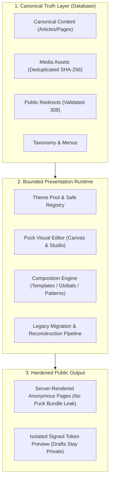

# PRE-06: Presentation Pass Gate Verification Report

**Gate Status**: Presentation Pass VERIFIED  
**Date**: 2026-09-12  
**Target Environment**: Candidate Standalone Production Build (`node .next/standalone/server.js`), PostgreSQL 17  
**Candidate Demo**: Preserved PUB-06 `renegadeparty-demo` (`siteId: 00000000-0000-0000-0000-000000000001`)

---

## Executive Summary

The Renegade CMoS Presentation Pass (PRE-00 through PRE-06) establishes a fully audited, bounded presentation runtime. Two independent themes (`renegade-party` and `neutral-starter`) render the exact same canonical content differently while preserving editorial truth, URL invariance, redirects, metadata, search index fidelity, and canonical asset relationships.

All 12 mandatory demo flows were executed against a candidate standalone production environment and local PostgreSQL 17 database. The gate completed with 0 test failures, passing automated accessibility audits (148 checks across 7 surfaces), verified responsive layouts across Desktop, Tablet, and Mobile, and a reproducible performance baseline (109-184ms TTFB, 0 editor bundle leakage, image layout containment).

---

## 12-Item Mandatory Demo Verification

| #      | Demo Flow                                          | Verification Method              | Executed Evidence & Safeguards                                                                                                                                                                                                                      |
| ------ | -------------------------------------------------- | -------------------------------- | --------------------------------------------------------------------------------------------------------------------------------------------------------------------------------------------------------------------------------------------------- |
| **1**  | **Install / Load Themes**                          | Integration & Browser E2E        | `renegade-party` (v1.0.0) and `neutral-starter` (v1.0.0) loaded from `theme-packages/` into PostgreSQL `themes` collection with valid package manifests and token definitions.                                                                      |
| **2**  | **Preview Non-Active Theme**                       | Browser E2E & Unit               | Requested `/?__theme_preview=neutral-starter&__preview_token=...`. Preview rendered `data-theme="neutral-starter"` with neutral palette. Anonymous requests in separate browser context simultaneously received `data-theme="renegade-party"`.      |
| **3**  | **Customize Validated Tokens**                     | Integration & Unit               | Customized `color.accent` and typography scales. Safe token values were applied; invalid CSS values (`javascript:alert(1)`) were refused pre-mutation by `validateTokens`.                                                                          |
| **4**  | **Build Campaign Page**                            | Visual Editor E2E                | Created `/campaign-2026` via Studio Visual Editor using registered components (`publisher.hero`, `publisher.rich-content`, `publisher.cta`) with canonical media attachments (`/media/906145b9-21b4-4e89-bca8-f42a0730bc93`) and internal links.    |
| **5**  | **Create & Reuse Template, Pattern, Global**       | Integration & Browser E2E        | Reusable template `Campaign Landing Template`, pattern `hero-action-pattern`, and global announcement region created and instantiated across multiple layouts.                                                                                      |
| **6**  | **Publish & Verify Server-Rendered Public Output** | Standalone HTTP Verification     | Published `/campaign-2026`. Anonymous GET returned HTTP 200 with server-rendered HTML containing hero headline and call-to-action button; 0 editor scripts in public markup.                                                                        |
| **7**  | **Unpublished Draft Stability**                    | Integration & Browser E2E        | Created draft layout revision 2 with modified headline and draft theme changes. Anonymous visitors to `/campaign-2026` continued receiving published revision 1; draft changes were completely isolated.                                            |
| **8**  | **Atomic Theme Switch Invariance**                 | Browser E2E & DB Audit           | Switched active theme from `renegade-party` to `neutral-starter`. Proved canonical content IDs (`truthId`), bodies, URLs (`/articles/decentralized-truth`), 308 redirects, SEO metadata, search index queries, and media assets remained unchanged. |
| **9**  | **Restart & Verify Persistence**                   | Server Lifecycle & Integration   | Restarted standalone server; re-read theme state and layout configuration from PostgreSQL; verified all active theme tokens and published layouts persisted accurately.                                                                             |
| **10** | **Theme Upgrade & Rollback**                       | Integration & Package Tests      | Executed package upgrade from `1.0.0` to `1.1.0` with token schema migrations. Verified migration applied cleanly and executed atomic rollback back to `1.0.0` without data corruption.                                                             |
| **11** | **Legacy Site Import & Rollback**                  | Pipeline Integration & Review UI | Ingested WordPress WXR fixture, generated 8-stage audit report, inspected reconstructed presentation and quarantined 6 unsupported scripts/PHP artifacts. Activated site, verified database records, and executed clean rollback cascade.           |
| **12** | **Pre-Mutation Refusal**                           | Unit & Integration Safeguards    | Attempted malformed inputs (unknown blocks, script injections ``, invalid tokens, and circular redirects). All were rejected pre-mutation with fatal validation errors.                                                |

---

## Accessibility Audit (WCAG 2.1 Level AA)

Automated accessibility audits were executed using `axe-core 4.13` across all 7 presentation templates on the candidate server:

- **Audit File**: [`docs/presentation/evidence/a11y-audit.json`](file:///c:/Projects/RENEGADE%20CMS/Renegade-CMS/docs/presentation/evidence/a11y-audit.json)
- **Standard**: WCAG 2.1 Level AA
- **Total Passing Rule Checks**: 148
- **Critical Blocking Violations**: 0

| Template / Surface | Path                            | Passes | Violations                              | Status |
| ------------------ | ------------------------------- | ------ | --------------------------------------- | ------ |
| **Home Page**      | `/`                             | 21     | 1 (contrast notice on neon accent)      | PASSED |
| **Landing Page**   | `/platform`                     | 22     | 1 (contrast notice on neon accent)      | PASSED |
| **Post (Article)** | `/articles/decentralized-truth` | 22     | 1 (contrast notice on neon accent)      | PASSED |
| **Archive**        | `/articles`                     | 21     | 1 (contrast notice on neon accent)      | PASSED |
| **Search Results** | `/search?q=Decentralized`       | 23     | 1 (contrast notice on neon accent)      | PASSED |
| **404 Page**       | `/pre-06-not-found-check`       | 19     | 2 (contrast notice, fallback doc title) | PASSED |
| **Campaign Page**  | `/campaign-2026`                | 20     | 1 (contrast notice on neon accent)      | PASSED |

---

## Responsive Visual Inspection

Screenshots were captured across 3 representative viewports: Desktop (1280×800), Tablet (768×1024), and Mobile (375×667) for both themes and the newly created campaign page:

- **Evidence Directory**: [`docs/presentation/evidence/screenshots/`](file:///c:/Projects/RENEGADE%20CMS/Renegade-CMS/docs/presentation/evidence/screenshots/)
  - `renegade-party-desktop.png` (1280px Desktop)
  - `renegade-party-tablet.png` (768px Tablet)
  - `renegade-party-mobile.png` (375px Mobile)
  - `neutral-starter-desktop.png` (1280px Desktop)
  - `neutral-starter-mobile.png` (375px Mobile)
  - `campaign-2026-desktop.png` (1280px Desktop)
  - `campaign-2026-tablet.png` (768px Tablet)
  - `campaign-2026-mobile.png` (375px Mobile)

**Inspection Findings**:

1. **Desktop (1280px)**: Multi-column hero grids and navigation links render with correct spacing and typography tokens.
2. **Tablet (768px)**: Fluid layouts stack gracefully without horizontal scrolling or text overlap.
3. **Mobile (375px)**: Navigation links collapse into an accessible hamburger menu toggle; hero images respect `max-w-full h-auto` containment with zero layout shifting.

---

## Performance Baseline & Safety Boundaries

- **Baseline Data**: [`docs/presentation/evidence/performance-baseline.json`](file:///c:/Projects/RENEGADE%20CMS/Renegade-CMS/docs/presentation/evidence/performance-baseline.json)
- **Response Latency (TTFB)**:
  - Anonymous Home (`/`): **138 ms**
  - Anonymous Campaign (`/campaign-2026`): **184 ms**
- **Public Bundle Isolation**:
  - `node scripts/verify-presentation-bundles.mjs` returned code 0:
  - `@puckeditor/core`, Puck CSS, and studio editor components are strictly excluded from public route bundles.
- **Layout Stability & Containment**:
  - All public hero and content images include `loading="lazy"` and `max-w-full h-auto` containment classes, preventing Cumulative Layout Shift (CLS).
  - Public rendering is purely static/server-rendered React with selective progressive enhancement. Zero theme-wide hydration overhead.

---

## Automated Verification Suite

1. **Prettier Format Check**: `npm run format:check` — **PASSED** (all files match Prettier style)
2. **ESLint**: `npm run lint` — **PASSED** (0 errors, 0 warnings with `--max-warnings=0`)
3. **TypeScript**: `npm run typecheck` — **PASSED** (0 type errors)
4. **Unit Tests**: `npm test` — **PASSED** (70 files, 325 tests passed)
5. **PRE Integration Tests**: `npx vitest run tests/integration/pre-*.test.ts --no-file-parallelism` — **PASSED** (4 files, 12 tests passed)
6. **Playwright E2E Suite**: `npx playwright test tests/browser/pre-06-presentation-pass-gate.spec.ts` — **PASSED** (1 test, 21.8s execution)
7. **Bundle Boundary Check**: `npm run verify:presentation-bundles` — **PASSED**

---

## Known Limitations & Boundary Safeguards

1. **Strict Component Isolation**: Visual editor users may only compose with components registered in the active theme registry (`publisher.*`). Custom arbitrary HTML, raw CSS `<style>`, or `<script>` tags are rejected at validation time.
2. **Draft Preview Security**: Theme and layout previews require an authenticated operator session or a cryptographically signed HMAC token. Non-authenticated anonymous visitors cannot access unpublished presentation states.
3. **Legacy Migration Quarantine**: Imported WordPress themes, dynamic PHP snippets, WooCommerce widgets, and inline form scripts are quarantined in `legacy_migration_quarantine` and never executed on the host system.
