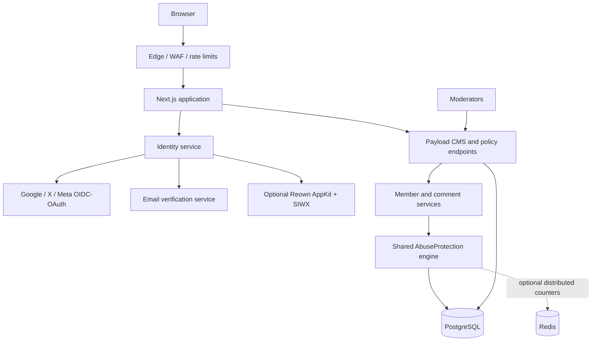

# Comments, Identity, and Abuse-Prevention Architecture

**Target platform:** self-hosted Next.js + React + Payload CMS + PostgreSQL  
**Audience:** engineering / architecture  
**Research snapshot:** August 10, 2026

## Technical summary

Build public participation as a first-party subsystem, not as a CMS comment plug-in and not as a dependency on any one login vendor. The canonical person is a `Member` record owned by the application. Google, X, Meta, verified email, passkeys, and wallets are **credentials linked to that member**, not the member itself. A public member is distinct from a Payload-admin user.

The production default should be: social or verified-email identity required; anonymous comments disabled; staff passkeys plus a second factor required; Cloudflare (or another edge provider) in front of the origin; deterministic risk rules before optional AI classification; and PostgreSQL-backed policy/audit data. Add Redis only when a second application process, high write rate, or durable distributed rate limiting makes it necessary.

This keeps the simple initial deployment to Cloudflare + VPS + PostgreSQL while preserving clean paths to Redis, queues, more providers, and multi-site managed hosting. Payload remains the content, permissions, and administration system; the public-identity module owns federated login, identity linking, user-facing sessions, and member risk state. Payload supports auth-enabled collections, custom strategies, and collection/field access control, which is sufficient for this boundary when it is implemented deliberately ([Payload authentication](https://payloadcms.com/docs/authentication/overview), [custom strategies](https://payloadcms.com/docs/authentication/custom-strategies), [access control](https://payloadcms.com/docs/access-control/overview)).

## A. Executive recommendation

Use a **three-domain model**:

1. **StaffUser** is the only auth-enabled collection allowed into Payload Admin. It is not publicly discoverable and is governed by mandatory phishing-resistant authentication, short sessions, step-up verification, audit logging, and least-privilege roles.
2. **Member** is the public account, with a stable internal UUID and a display profile. It may have many credentials but no direct CMS administrative permissions.
3. **Credential / Identity** is an immutable, provider-scoped proof attached to a Member: OIDC subject, email credential, passkey, or wallet address. Never use an email address or provider username as the primary account key.

Use Authorization Code + PKCE for OIDC/OAuth providers, with server-side transaction state bound to browser state. Treat an OIDC `sub` plus issuer as the durable external identifier. An email is a verified contact claim only when the provider asserts it is verified; OIDC explicitly distinguishes `email` from `email_verified` ([OpenID Connect Core](https://openid.net/specs/openid-connect-core-1_0.html)). Do not silently merge two members merely because their providers returned the same email. Offer an explicit, recently reauthenticated **link identity** operation instead.

For comments, keep the default two-stage workflow: create a non-public draft/submission, verify identity, run abuse assessment, then publish or queue for review. The public API should never let the browser set an approved status, risk score, author type, or moderation result.

## B. Architecture diagram



**Request path.** The edge rejects obvious hostile traffic, applies coarse rate limits and, when needed, challenges. Next.js verifies the edge-provided request context, applies route-specific policy, obtains the member session, and calls the central `AbuseProtection` service before an action is committed. Payload enforces data access and runs transactional state changes. Email, OAuth, wallet, and optional AI vendors sit behind adapters.

## C. Recommended data model

Use PostgreSQL constraints for invariants that must survive application bugs. UUIDs should be random UUIDv7/ULID-compatible IDs; timestamps are UTC; IP data is minimized as described below. Relationship names are conceptual Payload collections/tables, not a required exact schema.

| Entity                | Core fields and constraints                                                                                                                                                                                            | Purpose                                                                                                    |
| --------------------- | ---------------------------------------------------------------------------------------------------------------------------------------------------------------------------------------------------------------------- | ---------------------------------------------------------------------------------------------------------- |
| `members`             | `id`, `status`, `display_name`, `public_handle`, `trust_tier`, `email_contact_id?`, `created_at`, `last_active_at`, `deleted_at`                                                                                       | Canonical public person. Unique handle only if handles are enabled.                                        |
| `member_identities`   | `id`, `member_id`, `kind`, `issuer`, `subject`, `email_normalized?`, `email_verified`, `metadata_minimized`, `linked_at`, `last_used_at`, `revoked_at`                                                                 | Unique `(kind, issuer, subject)` for the active lifetime. A social subject is never reused across Members. |
| `member_passkeys`     | `id`, `member_id`, `credential_id`, `public_key`, `sign_count`, `transports`, `backup_eligible`, `last_used_at`                                                                                                        | Optional member convenience/recovery credential. Credential ID unique.                                     |
| `member_wallets`      | `id`, `member_id`, `namespace`, `chain_ref`, `address_normalized`, `first_proved_at`, `last_proved_at`, `revoked_at`                                                                                                   | Unique active `(namespace, chain_ref, address_normalized)`. No token balances or transaction history.      |
| `member_sessions`     | opaque token hash, `member_id`, `issued_at`, `expires_at`, `absolute_expires_at`, `last_seen_at`, `ip_prefix_hash?`, `ua_hash?`, `revoked_at`                                                                          | Server-side session registry and device management.                                                        |
| `comments`            | `id`, `content_type`, `content_id`, `parent_id?`, `root_id`, `depth`, `path`, `author_member_id?`, `author_snapshot`, `body_source`, `body_rendered`, `status`, `version`, `published_at`, `locked_at?`, `deleted_at?` | Comment source, safe render, state machine, and shallow tree location.                                     |
| `comment_revisions`   | `comment_id`, `editor_member_id`, `body_source`, `reason`, `created_at`                                                                                                                                                | Immutable edit record. Keep only when edits are enabled.                                                   |
| `comment_reports`     | `comment_id`, `reporter_member_id`, `reason_code`, `note`, `status`, unique active report per reporter/comment                                                                                                         | Reporting queue with deduplication.                                                                        |
| `moderation_actions`  | actor StaffUser/Member, target type/id, action, before/after state, reason code, note, security-event reference                                                                                                        | Immutable reviewable moderator trail.                                                                      |
| `verification_tokens` | `purpose`, `member_id?`, `email_normalized?`, `token_hash`, `expires_at`, `used_at`, `request_fingerprint`, `created_at`                                                                                               | Single-use verification, magic-link, linking confirmation, and recovery tokens.                            |
| `security_events`     | actor references, event type, result, risk band, policy version, request ID, `ip_prefix_hash?`, `details_redacted`, expiry                                                                                             | Bounded audit data for login, challenge, abuse, moderation, and policy decisions.                          |
| `network_rules`       | scope, action, subject type (IP/CIDR/ASN/country), value, precedence, start/end, reason, created_by                                                                                                                    | Application mirror of owner-configured network policy. It does not replace edge enforcement.               |
| `bans`                | target member/identity/network, reason, level, start/end, review_at, created_by, source event                                                                                                                          | Manual and automated restrictions. Automatic bans expire.                                                  |
| `rate_limit_policies` | action key, subject dimensions, window, quota, response, risk/profile scope                                                                                                                                            | Versioned configuration, not counters.                                                                     |

### Comment tree and content association

Use an **adjacency list plus materialized path**, limited to depth 3 by default (top-level → reply → nested reply). Store `parent_id`, `root_id`, `depth`, and an immutable sortable `path` such as `0001.0017.0003`. Index `(content_type, content_id, root_id, status, published_at)` and `(root_id, path)`. This gives simple inserts, predictable pagination of top-level threads, and one ordered range scan to read a thread. It avoids the write amplification of closure tables and the complexity of unbounded recursive queries.

Do not offer unlimited Reddit-style nesting in V1. For deeper replies, attach to the nearest allowed parent and display “replying to …”. For exceptional future needs, PostgreSQL recursive queries remain available; a closure table is only justified after measured deep-tree workloads make it worthwhile.

## D. Authentication recommendation

### Chosen design: a first-party identity orchestration module

Build a small `IdentityService` inside the application and store canonical members/identities in Payload/PostgreSQL. It owns provider adapters, callback transaction validation, safe linking, and server-side member sessions. It is **not** a generic identity provider, and it does not need an external auth SaaS.

Use Payload native auth for **StaffUser**. Configure `admin.user: 'staff-users'`; Payload’s admin panel supports exactly one designated auth collection ([Payload Admin overview](https://payloadcms.com/docs/admin/overview)). Use Payload custom auth strategies only where they reduce integration friction, not as an excuse to expose public members as Payload admins.

| Approach                                                                        | Decision                                 | Why                                                                                                                                                                                                            |
| ------------------------------------------------------------------------------- | ---------------------------------------- | -------------------------------------------------------------------------------------------------------------------------------------------------------------------------------------------------------------- |
| Payload-only, one auth collection for staff and readers                         | Reject                                   | Blurs trust domains and creates accidental privilege paths.                                                                                                                                                    |
| Auth.js / Better Auth as the public identity authority                          | Conditional adapter, not core dependency | Both can speed implementation, but their schema/session assumptions become part of the platform contract. Adopt only after a version-pinned proof of safe linking, adapter support, and Payload compatibility. |
| First-party `IdentityService` + provider adapters + Payload data/access control | **Recommend**                            | Best match for replaceability, exact member model, wallet support, and self-hosting. More code, but the security-sensitive code surface is bounded.                                                            |
| External customer identity SaaS                                                 | Do not require                           | Faster setup but weakens portability and can create a pricing/availability dependency. Optional managed-hosting integration can come later.                                                                    |

### Staff authentication

Staff users must use passkeys/WebAuthn and a second recovery factor. WebAuthn credentials are origin-scoped public-key credentials and private keys remain in the authenticator, which makes them the preferred day-to-day staff method ([W3C WebAuthn](https://www.w3.org/TR/webauthn-3/)). Require user verification, do not accept “presence only” for administrators.

- Require two registered recovery-capable methods before an owner can remove the last passkey.
- Use 8–12 hour idle/absolute staff sessions, rotate opaque session IDs after login and privilege changes, and revoke all sessions on password/recovery/role changes.
- Require fresh passkey or second-factor verification for role changes, API key creation, identity merges, security-policy changes, exports, and destructive moderation.
- Keep recovery codes offline, one-time, hashed at rest, and visible only at generation. Do not use an emailed reset link alone as the sole owner recovery path.
- Give `Owner` its own protection policy; do not allow an `Administrator` to silently escalate to Owner. Roles: Owner, Administrator, Editor, Author, Contributor, Moderator, Social Manager, Analyst.

### OAuth/OIDC and account linking

For OIDC-capable providers: authorization-code flow, PKCE, a cryptographically random `state`, nonce where an ID token is used, exact registered redirect URIs, issuer/audience/signature/expiry validation, and callback transaction records that are single-use and short-lived. OWASP’s OAuth guidance is the baseline ([OAuth 2.0 Cheat Sheet](https://cheatsheetseries.owasp.org/cheatsheets/OAuth2_Cheat_Sheet.html)). X and Meta configuration, scopes, review requirements, and email behavior are vendor-variable: confirm them in a provider certification test before promising them in a product tier.

On login: resolve only on `(issuer, subject)`. If the identity exists, authenticate its member. If it is new and the user initiated **login**, create a new provisional Member or show a safe “existing account?” recovery path. If a matching verified email exists, show a non-enumerating choice: “This email may already be associated with an account. Sign in to that account and link this identity.” Do not merge automatically.

On linking: require an active member session reauthenticated within 10 minutes plus successful proof from the new provider. If the identity belongs to another Member, stop and use a deliberate, audited merge/recovery workflow requiring proof of both accounts. A link must never be driven by an email claim alone. This is the main defense against account-linking takeover.

## E. Verified-email comment architecture

**Recommendation:** verified email creates or attaches a `Member`; it is authentication after successful confirmation, not merely a comment flag. That produces one coherent public identity and lets the person manage, edit, and report comments. The initial comment is still held until verification and policy evaluation finish.

1. Browser submits display name, email, comment body, content reference, and idempotency key to `POST /participation/comment-intents`. A honeypot/timing check, edge context, and route limit run first.
2. Server normalizes email for lookup (while preserving a display form separately), creates a `Comment` in `unverified`, and creates a `VerificationToken` with a purpose bound to the comment intent and member/email. Never return whether the email already has an account.
3. Generate 32 random bytes with CSPRNG, encode base64url, store only a keyed hash of the raw token, set a 15-minute expiry, and send a one-time HTTPS URL. Put no email, comment text, member ID, or authorization state in the URL.
4. User opens the link. The GET route performs no state change; it places a short-lived confirmation transaction in an HttpOnly cookie and renders a confirm page. The POST confirmation atomically marks the token used only if `used_at IS NULL` and `expires_at > now()`.
5. In the same transaction, find/create Member, attach verified email identity, attach the intent comment, recalculate risk, and move the comment to `approved`, `pending`, or `spam/rejected`. Issue a rotated server-side member session after confirmation.
6. Return a neutral result: “Your comment was verified and is visible / awaiting review.” The result must not disclose bans, reputation rules, or account existence.

Use database uniqueness on `(purpose, token_hash)` and a conditional update as the single-use primitive. Store only the hash, redact the query portion of magic-link URLs from logs, add `Referrer-Policy: no-referrer` on confirmation pages, and delete/expire unused intent data quickly. A new link invalidates older unused links for the same purpose, subject to a short anti-DoS cooldown. This follows the general OWASP principle that sensitive account changes require current credentials or equivalent proof ([Authentication Cheat Sheet](https://cheatsheetseries.owasp.org/cheatsheets/Authentication_Cheat_Sheet.html)).

## F. Web3 architecture

Wallet authentication is an optional `WalletIdentityProvider`, loaded only when enabled. Reown AppKit belongs in the **browser connection UX**, while the application’s server verifies a signed, short-lived authentication message and creates its ordinary member session. Wallet connection itself is not authentication.

For a new implementation, prefer a server-owned SIWX adapter; Reown currently describes SIWX as its multichain path and recommends it for new work, while SIWE remains applicable for Ethereum-only flows ([Reown SIWX](https://docs.reown.com/appkit/javascript/core/siwx), [Reown SIWE](https://docs.reown.com/appkit/next/core/siwe)). The adapter must:

- issue a nonce stored server-side and bound to purpose, domain, URI, chain/namespace, session/transaction, and expiry;
- verify signature, nonce, issued/expiry time, domain/URI, chain reference, and address normalization on the server;
- atomically consume the nonce before a session or link happens;
- support EVM first and Solana only after a separately tested verifier/namespace adapter;
- never request token approvals, transactions, seed phrases, or private keys; label the action “sign in” and show the exact domain;
- allow multiple wallets per Member, but treat a wallet as one credential, not a recovery method by itself; and
- provide unlink/revoke that removes local association and sessions, while acknowledging that the chain cannot revoke a prior signature or prove a wallet has not been compromised.

Do not use wallet holdings, NFT ownership, or on-chain behavior in default risk scoring. They are privacy-invasive, expensive, and poor proxies for good-faith participation.

## G. Comment, moderation, and trust architecture

### Permission and lifecycle rules

`unverified → pending | approved | spam | rejected`; `approved → removed | pending`; `pending → approved | rejected | spam`; `removed` is a public tombstone/hidden state rather than a physical deletion. State changes are made only by the service layer and logged in `ModerationAction`.

Members may edit their own published comment for 15 minutes, with a visible “edited” marker and immutable revision. Disable edits for locked/removed threads. Staff may pin, lock, hide, restore, or change status based on role. Content owners can turn comments off per item; a locked thread preserves reading but blocks submissions.

Moderation queue rows must show an explainable evidence bundle, for example: “new account (3m), 4 links, text similarity 0.97 to 8 recent submissions, 9 attempts/60s.” Display confidence band and rules fired, not a black-box score. Moderators see raw IP only if the owner explicitly enables tightly limited access; otherwise use masked/prefix/hashed network context.

### Lightweight trust, not karma

Use operational tiers: `new`, `established`, `trusted`, `restricted`, `banned`. They are **policy inputs**, not public scores. Start all new members at `new`. Advance based on account age, verified credential diversity, approved-comment history, and absence of adverse moderation. Restrict based on confirmed abuse, repeated rejected submissions, and strong multi-signal evidence. Do not lower access based on opinions, downvotes, engagement, wallet wealth, or protected characteristics.

Trust changes should be reversible and explainable. A member should be able to ask for review. Automated actions may reduce rate limits or send to moderation; permanent member/network bans require staff approval except for an explicit owner rule. This prevents a poisoned signal or shared network from becoming an irreversible lockout.

## H. Abuse-prevention architecture

Create a shared service boundary:

```ts
type AbuseDecision = {
  action: 'allow' | 'challenge' | 'hold' | 'reject' | 'throttle' | 'block'
  risk: 'low' | 'medium' | 'high' | 'critical'
  reasonCodes: string[]
  retryAfterSeconds?: number
}

interface AbuseProtection {
  assess(input: ActionContext): Promise<AbuseDecision>
  record(event: SecurityEventInput): Promise<void>
  enforceNetworkRules(input: NetworkContext): Promise<NetworkDecision>
}
```

Every public mutating feature calls the same service: comments, contact forms, newsletter opt-in, registration, login, verification links, reports, commerce, and future plugins. Policy is configuration data, evaluated by a small deterministic rules engine; never distribute one-off anti-spam code through controllers.

**Rule first, AI last.** Deterministic checks cover hard blocks, route quotas, duplicate/idempotency conflict, link count, content size, Unicode normalization/zero-width characters, honeypot, impossible timing, repeated text hashes/similarity candidates, account age, identity proof, and known moderation history. These rules decide obvious low and high risk. Optional AI only classifies the narrow ambiguous band and must return a structured label/reason, have a timeout/fail-open-to-moderation behavior, and never auto-ban or auto-delete alone.

Suggested default decision bands:

| Risk     | Default action                     | Examples                                                                 |
| -------- | ---------------------------------- | ------------------------------------------------------------------------ |
| Low      | Publish when site policy permits   | established member; clean text; normal velocity                          |
| Medium   | Queue / silent extra verification  | new verified member; first external link; uncertain similarity           |
| High     | Challenge then queue or reject     | multiple URLs, rapid retries, failed challenge, repeated text            |
| Critical | Temporary block, log, staff review | explicit rule match, impossible burst, malicious payload, banned subject |

## I. Rate-limiting architecture

Use two independent layers. At the edge, absorb volumetric/application floods, country/ASN rules, obvious bots, cacheable public routes, and coarse endpoint limits. In the application, make identity-aware decisions after authentication and enforce invariants the edge cannot see.

| Action family            | Primary keys                             | Initial approach      | Example response              |
| ------------------------ | ---------------------------------------- | --------------------- | ----------------------------- |
| General request/API      | IP prefix + route                        | Edge                  | 429/challenge                 |
| Search                   | IP prefix + session                      | Edge and app          | throttle; cache               |
| Comment/reply            | Member + IP prefix + content fingerprint | App plus edge ceiling | hold/429                      |
| OAuth start/callback     | IP prefix + session transaction          | App                   | reject invalid/replayed state |
| Email/magic-link request | normalized email hash + IP prefix        | App                   | neutral success, cooldown     |
| Login/recovery           | account identifier hash + IP prefix      | App plus edge         | progressive delay/challenge   |
| Reports/forms/newsletter | IP prefix + member + route               | Both                  | throttle/queue                |
| Admin login/actions      | staff ID + IP prefix + route             | Both                  | deny/step-up/audit            |

Do not make raw IP a universal identity. Use a key set: member ID for authenticated abuse, /24 IPv4 or /56 IPv6 prefix for network behavior, plus session/email/provider/wallet hash where appropriate. Shared NAT and mobile networks make IP-only punishment unreliable; rotating residential bots make IP-only defenses weak. Trust `CF-Connecting-IP` or equivalent only when the origin accepts traffic exclusively from the configured edge.

For one VPS and one application process, PostgreSQL can host policy and coarse sliding/fixed-window counters, but use `INSERT … ON CONFLICT`/atomic updates and aggressively expire buckets. It is adequate for early low-to-moderate traffic, not for attack-scale counters. Introduce Redis when horizontally scaling Next.js, running separate workers, or measuring lock contention/latency. Do not use in-memory limits as security controls: restarts and multiple processes bypass them.

## J. Cloudflare and network architecture

Cloudflare is the recommended first `EdgeSecurityProvider`, but all application policies must target a provider-neutral abstraction: `allow`, `block`, `managed_challenge`, `rate_limit`, and `log`. Cloudflare custom rules, country/ASN signals, WAF, rate limits, and Turnstile give a strong initial edge. Challenge only risk-triggered routes or suspicious traffic; Turnstile tokens require server-side Siteverify validation, not just a client widget ([Cloudflare Turnstile guidance](https://developers.cloudflare.com/turnstile/)).

**Origin protection is non-negotiable.** A proxied DNS record alone is not sufficient. Cloudflare explicitly warns that a discovered origin IP can bypass Cloudflare protections; authenticated origin pulls can make the origin accept only traffic that came through Cloudflare ([Authenticated Origin Pulls](https://developers.cloudflare.com/ssl/origin-configuration/authenticated-origin-pull/)). Preferred deployment order:

1. Use Cloudflare Tunnel where practical, so the VPS has no public web origin port. It uses outbound-only connections and removes the public origin-IP path ([origin protection](https://developers.cloudflare.com/fundamentals/security/protect-your-origin-server/)).
2. If a tunnel is not used, firewall 80/443 to Cloudflare IP ranges only, use authenticated origin pulls/mTLS, validate the expected host, and keep the VPS management port behind a VPN/Tailscale or explicit IP allowlist.
3. Do not expose database, Redis, Payload admin, or worker ports publicly. Bind them to loopback/private networking.

Geo controls belong at the edge for speed and cost. The product’s Security Center should support allow/block/challenge country rules, IP/CIDR and ASN rules, expiry, exceptions, and audit reasons. Provide a crawler-safe exception policy based on verified bot verification, not user-agent strings. Advise owners that aggressive country or ASN blocking can deny legitimate travelers, VPNs, journalists, and distributed corporate users; show estimated impact and a break-glass allowlist.

## K. Threat model

| Threat                               | Likelihood |   Impact | Primary mitigation                                                                                                                                                                                                          | Residual risk                                      |
| ------------------------------------ | ---------: | -------: | --------------------------------------------------------------------------------------------------------------------------------------------------------------------------------------------------------------------------- | -------------------------------------------------- |
| Credential stuffing / password spray |     Medium |     High | Staff passkeys/MFA; route limits; breached-password controls if passwords exist; anomaly alerts                                                                                                                             | Stolen authenticated session                       |
| OAuth CSRF, mix-up, callback replay  |     Medium |     High | PKCE, state/nonce, exact redirects, issuer/audience checks, single-use transaction                                                                                                                                          | Provider compromise/config error                   |
| Account-linking takeover             |     Medium | Critical | Fresh local reauth + proof of new credential; no email-only merge; audit/review merge                                                                                                                                       | Compromise of both credentials                     |
| Stolen/fixed session                 |     Medium |     High | Opaque HttpOnly Secure SameSite cookies; rotation; server registry/revocation; step-up                                                                                                                                      | Endpoint XSS or device malware                     |
| Magic-link interception/replay       |    Low-Med |     High | 256-bit token, hashed storage, 15m expiry, GET→POST confirmation, single use, referrer/log redaction                                                                                                                        | Compromised mailbox/device                         |
| Comment spam/flood                   |       High |   Medium | Identity requirement; edge/app limits; deterministic risk; queues; challenges                                                                                                                                               | Determined human-assisted spam                     |
| XSS / HTML / Markdown injection      |       High | Critical | Plain-text/limited Markdown input; server-side allowlist sanitizer; safe renderer; CSP; no raw HTML                                                                                                                         | Sanitizer zero-day                                 |
| CSRF                                 |     Medium |     High | SameSite cookies plus origin checks and CSRF token for unsafe browser requests; bind token to session ([OWASP CSRF](https://cheatsheetseries.owasp.org/cheatsheets/Cross-Site_Request_Forgery_Prevention_Cheat_Sheet.html)) | Browser/vendor defects                             |
| SQL injection                        |     Medium | Critical | Payload/parameterized queries only; no dynamic SQL; least-privileged DB role                                                                                                                                                | Dependency defect                                  |
| Origin-IP bypass / DDoS              |     Medium | Critical | Tunnel or firewall + authenticated origin pulls; edge WAF/rate limits                                                                                                                                                       | Network-layer attack against VPS IP if exposed     |
| Compromised admin                    |     Medium | Critical | Passkeys, second factor, least privilege, step-up, audit, session revoke                                                                                                                                                    | Owner endpoint/device compromise                   |
| Wallet phishing / signature replay   |     Medium |     High | Server nonce/domain/expiry binding; clear message; SIWX verification; no transaction requests                                                                                                                               | Malicious wallet extension/user signing wrong site |
| Webhook spoofing                     |     Medium |     High | Verify signature, timestamp, replay window, idempotency                                                                                                                                                                     | Provider secret theft                              |
| Plugin/dependency abuse              |     Medium |     High | Pin/scan dependencies, minimal plugin API, capability permissions, security updates                                                                                                                                         | Supply-chain compromise                            |

## L. Privacy and retention model

Collect what is needed to defend the site, not a surveillance archive. Store email, social subject, wallet address, security events, and profile claims separately from public comment content. Never expose email, provider subject, full IP, or wallet association in public APIs.

| Data                 | Storage recommendation                                                                                          | Default retention                                                       |
| -------------------- | --------------------------------------------------------------------------------------------------------------- | ----------------------------------------------------------------------- |
| Raw IP               | Avoid persistent storage; process at request time. If needed for an active incident, encrypt/access-control it. | 7 days maximum, then delete/anonymize                                   |
| Network reference    | Keyed hash of IP prefix plus secret version; rotate secret periodically.                                        | 30–90 days for security events                                          |
| Auth/security events | Redacted event data and actor IDs, no tokens or full URLs.                                                      | 90 days; 1 year for staff/critical actions                              |
| Email                | normalized encrypted/contact field and verification state only                                                  | until member deletes or 12 months inactive, subject to policy           |
| OAuth profile        | issuer, subject, verified email flag, minimal display metadata                                                  | while linked; remove after unlink unless audit/legal hold               |
| Wallet               | namespace, chain, address, proof times only                                                                     | while linked; remove upon unlink where no fraud hold                    |
| Verification tokens  | hashes only                                                                                                     | immediately after use; expired rows purge within 24h                    |
| Removed comments     | soft delete with reason for appeal                                                                              | 90–180 days then anonymize/purge; longer only for documented legal need |

Provide export/delete tools. Deletion should revoke sessions, unlink credentials, replace comment author display with an anonymized label while preserving moderation integrity where necessary, and purge data on a defined schedule. Document geo blocking and security logging in the privacy notice. Obtain legal review for the jurisdictions actually served; this architecture is not legal advice.

## M. Operational requirements

### Required V1 infrastructure

- Cloudflare DNS/proxy, WAF/custom rules, rate limits, and Turnstile integration.
- One VPS running Next.js/Payload, PostgreSQL, backups, monitoring, log rotation, and a transactional email provider.
- Private origin: Cloudflare Tunnel preferred; otherwise strict firewall plus authenticated origin pulls.
- Secrets manager/environment isolation, TLS, automatic security updates, dependency scanning, off-site encrypted database backups, and restore drills.

### Optional when evidence justifies it

- Redis for distributed counters, short-lived transactions, queue coordination, or multiple app instances.
- Separate worker/queue for email, notifications, spam similarity, and AI classification. Begin with a durable PostgreSQL job table; add a dedicated queue/worker only when latency or retries demand it.
- Managed WAF/bot add-ons, IP intelligence, disposable-email data, or AI moderation providers.

## N. Build vs integrate matrix

| Subsystem                                                                       | Decision                                      | Reason                                                                                   |
| ------------------------------------------------------------------------------- | --------------------------------------------- | ---------------------------------------------------------------------------------------- |
| Canonical Member, linked identity model, security policy, comment state machine | **Build**                                     | This is the portable product behavior and core differentiation.                          |
| Payload collections, auth, access control, admin UI extension                   | **Use existing open source**                  | Native stack capability; avoid recreating a CMS.                                         |
| OAuth/OIDC protocol client / provider adapters                                  | **Integrate**                                 | Standards are complex; use a vetted library behind a local adapter.                      |
| Staff passkey ceremonies                                                        | **Integrate**                                 | Use mature WebAuthn server/client libraries; retain credential data and policy locally.  |
| Email delivery                                                                  | **External provider** with adapter            | Deliverability is operationally hard; keep message/templates/token authority in product. |
| Edge WAF, geo/ASN, DDoS, Turnstile                                              | **External provider** initially               | Edge network capability cannot be recreated on a VPS.                                    |
| Abuse rules, explainability, ban escalation, moderation workflow                | **Build**                                     | Must be shared, transparent, and vendor-neutral.                                         |
| IP/ASN reputation / disposable-email feeds                                      | **Integrate, optional**                       | Useful signal, not an identity authority.                                                |
| AI comment classifier                                                           | **External provider or self-hosted optional** | Never a requirement for baseline safety.                                                 |
| Reown/AppKit wallet connection                                                  | **Integrate, optional plugin**                | Strong ecosystem UX; local server retains proof and session control.                     |

## O. Tool and library comparison

| Area                      | Credible options                                                               | Recommendation and risk                                                                                                                                                                                                      |
| ------------------------- | ------------------------------------------------------------------------------ | ---------------------------------------------------------------------------------------------------------------------------------------------------------------------------------------------------------------------------- |
| Public auth orchestration | First-party module; Auth.js; Better Auth; external CIAM                        | First-party orchestration with vetted protocol libraries. Auth.js/Better Auth are worth a time-boxed proof, but do not let their default account schema dictate member/linking semantics. External CIAM has highest lock-in. |
| OAuth/OIDC                | Standards client library; provider SDKs                                        | Use a standards-focused library and one adapter interface. Provider SDKs tend to increase lock-in and differ in behavior.                                                                                                    |
| Passkeys                  | SimpleWebAuthn or equivalent maintained WebAuthn implementation                | Integrate; verify maintenance, license, supported WebAuthn level, and server challenge storage at the exact version chosen.                                                                                                  |
| Sessions                  | Payload JWT/cookies; first-party opaque DB sessions; external session provider | Opaque, HttpOnly, server-revocable public sessions. JWT-only sessions make immediate revocation and device control harder.                                                                                                   |
| Wallet auth               | Reown AppKit + custom SIWX; direct SIWE/Solana libs                            | Reown in the UI, server-owned verifier/nonce adapter. Reown is optional and should not own Member data.                                                                                                                      |
| Rate limits               | Cloudflare; PostgreSQL; Redis; hosted services                                 | Cloudflare + PostgreSQL in V1; Redis later. In-memory limits are unsuitable beyond a demo.                                                                                                                                   |
| Challenges                | Cloudflare Turnstile; hCaptcha; proof-of-work                                  | Turnstile first behind `ChallengeProvider`; challenge only suspicious flows. Validate server-side.                                                                                                                           |
| Spam classification       | Rules; local model; external model/API                                         | Rules mandatory. AI is a bounded, auditable secondary signal only.                                                                                                                                                           |

Exact maturity, licensing, security advisories, and provider terms must be rechecked at dependency-selection time. These move faster than the architecture. Pin versions, maintain an SBOM, subscribe to advisories, and include a small integration test suite covering callback validation, linking, token use-once, and session revocation.

## P. Recommended V1

Implement the smallest production-safe slice:

1. Separate `staff-users` and `members`; configure Payload Admin exclusively for staff.
2. Google OIDC plus verified-email comment confirmation. Ship X, Meta, Apple, passkeys for members, and wallets only after adapter tests, not before.
3. First-party `IdentityService` with server-side opaque member sessions, explicit identity linking, and no automatic merging.
4. Shallow threaded comments, content-level off/lock, pending/approved/spam/removed states, reports, moderator notes, audit actions, and a basic explainable queue.
5. Central `AbuseProtection`: limits, honeypot, timing, link limits, duplicate fingerprints, text normalization, account-age rules, temporary blocks, and provider-neutral challenge hook.
6. Cloudflare proxy + Turnstile on risk-triggered submissions, aggressive configurable geo/CIDR rules, and a protected origin.
7. PostgreSQL policy/counter/job tables, transactional email, backups, structured/redacted security logs, and an owner-only Security Center with Standard/Hardened/Maximum presets.

Do **not** ship V1 with automatic permanent bans, unbounded threading, public reputation scores, AI-required moderation, email/password public accounts, wallet-based status scoring, or a Redis/queue cluster unless load testing proves need.

## Q. Future expansion

The chosen boundaries support growth without a rewrite:

- Add providers by implementing `IdentityProvider` and safe-link tests; no comment-table changes.
- Add Redis and workers behind counter/job interfaces, with PostgreSQL remaining the system of record.
- Move from site-local `SecurityEvent` aggregation to a privacy-preserving, opt-in hosted threat-intelligence service with salted/rotating identifiers.
- Add multi-tenancy with `site_id` scoped to Member, policy, content, comments, rules, and events. A managed platform must preserve customer export, per-site encryption/configuration, and no cross-tenant raw IP visibility.
- Add advanced trust only after enough moderator-labeled outcomes exist to validate fairness, false positives, and appeal rate.
- Add namespaces/chains through wallet adapters, preserving the same proof/session interface.

## R. Open questions and risks

1. **Provider viability:** X and Meta access, scopes, email verification claims, app-review obligations, pricing, and rate limits must be tested against their current developer terms before they become promised product features.
2. **Public member passkeys:** V1 can defer them because Google/email cover the basic goal. Decide after measuring whether email link friction is a real retention problem.
3. **Content rendering:** Choose a constrained Markdown subset or plain text. Do not accept arbitrary HTML. The sanitizer and CSP need implementation-specific security tests.
4. **Cloudflare plan economics:** Confirm which WAF/rate-limit/ASN/bot controls are available at the planned tier; preserve fallback behavior at the application layer.
5. **Email provider and regional compliance:** Deliverability, suppression handling, data-processing terms, and legal retention rules need a deployment-specific decision.
6. **Appeals and moderator governance:** The product needs a human policy: who can ban, how owner decisions are reviewed, and what records are retained. Software cannot answer that by itself.
7. **Threat threshold tuning:** Initial rate/risk values are intentionally conservative defaults. Run adversarial tests and observe false-positive rates before tightening them for real readers.

## Implementation order

1. Define collections, state transitions, indexes, and access-control tests.
2. Implement staff security and origin lockdown before activating public participation.
3. Implement member sessions, Google OIDC, email verification, and explicit linking.
4. Implement comment intent/verification/state machine and safe rendering.
5. Implement `AbuseProtection`, edge integration, moderation queue, and audit event review.
6. Add provider adapters one at a time, each with callback/link/revocation/recovery tests.
7. Add wallets, Redis, AI classification, and advanced reputation only when the preceding layer is stable and measured.

This report deliberately treats vendor policies and plan features as changeable. The durable contract is the application-owned Member, credential, session, comment, policy, and audit model; external providers are replaceable implementations behind it.
