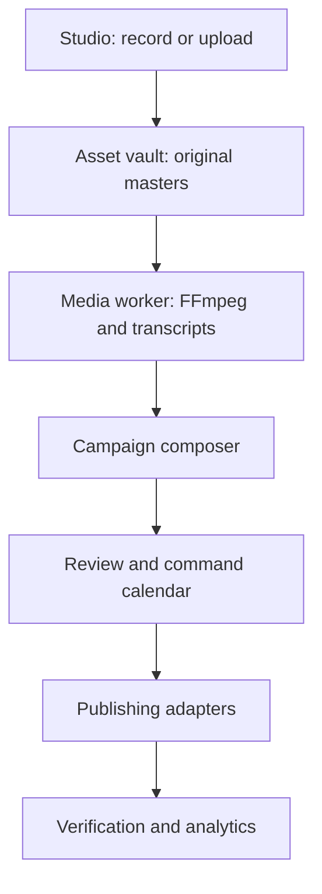

# Renegade CMS Media, Distribution, and Calendar Command Center

**Research and implementation architecture — August 10, 2026**

## Executive decision

Build this as a **media and distribution subsystem inside the existing Next.js + Payload CMS modular monolith**, with separate worker processes for scheduled publishing and FFmpeg media processing.

The winning architecture is:

```text
Record or upload once
→ preserve a private original master
→ inspect, transcode, transcribe, and create reusable variants
→ attach the media to a canonical site article, episode, or video
→ create one campaign and per-network delivery targets
→ review and schedule those targets on one calendar
→ publish through provider adapters
→ verify, retry, reconcile, and retain external URLs and analytics
```

Do **not** send large audio/video files through ordinary Next.js/Payload request bodies. The browser should upload directly to S3-compatible object storage with resumable multipart transfers. Next.js and Payload should authorize the transfer, store metadata, control workflow, and expose the command-center UI.

Use Payload's built-in Jobs Queue first rather than adding Redis and BullMQ. Run at least two queues:

- `publishing-critical`: due social posts, newsletters, podcast feed changes, token refreshes, and delivery verification.
- `media-heavy`: FFmpeg probing, transcoding, thumbnails, waveform generation, captions, and transcription.

Run these as separate worker processes. A long video encode must never delay a scheduled post.

The biggest product constraint is not technical: **a completely self-hosted application cannot also provide zero-configuration social OAuth for every network without some shared service**. Networks require registered applications, protected client secrets, fixed redirect URLs, reviews, scopes, quotas, and sometimes audits. Renegade should therefore support two connection modes:

1. **Renegade Connect (turnkey):** an optional hosted OAuth/connector broker operated by the Renegade project or a supported third-party relay.
2. **Independent mode (maximum sovereignty):** the site owner supplies their own platform app credentials and the same local adapters are used directly.

This preserves the free self-hosted core while making “connect once, use everywhere” achievable for ordinary users.

## 1. Project spine

### User and outcome

The user is a writer, publisher, podcaster, video creator, political organization, newsroom, or personal brand that wants one owned operating system for its website and outbound channels.

The final useful output is not merely a scheduled social post. It is a **campaign with an owned canonical page, durable media masters, approved channel-specific versions, scheduled deliveries, publication evidence, and reusable performance history**.

### Core loop

`capture → preserve → transform → compose → adapt → approve → schedule → publish → verify → measure → reuse`

### Durable advantage

Renegade's advantage is the canonical campaign/content model. Social networks become replaceable delivery destinations rather than the place where the content and workflow live.

### First narrow boundary

Prove one complete path:

> Upload or record one video → produce a web MP4 and thumbnail → create a canonical Renegade video/article page → customize a Bluesky post and YouTube upload → schedule both → publish → record external IDs/URLs → retry one simulated failure.

Bluesky is a relatively open first social adapter. YouTube proves the much harder resumable media-upload path. Add Meta/TikTok only after their application approval work begins.

## 2. System boundaries and dependency order



The dependency order is important:

1. Asset identity, storage, and upload recovery.
2. Media inspection and variant generation.
3. Canonical content/campaign model.
4. Account connections and capability discovery.
5. Per-target composition and validation.
6. Approval, scheduling, idempotent job dispatch.
7. Provider adapters and result reconciliation.
8. Calendar projection, analytics, and reuse automation.

The calendar is a projection of real campaign, production, content, and delivery records. It must not become a second database containing disconnected copies of publishing dates.

## 3. Recommended technology decisions

| Responsibility            | Choice                                                            | Why                                                                                              | Constraint                                                                   | Revisit trigger                                                                     |
| ------------------------- | ----------------------------------------------------------------- | ------------------------------------------------------------------------------------------------ | ---------------------------------------------------------------------------- | ----------------------------------------------------------------------------------- |
| CMS and control plane     | Existing Next.js + Payload CMS                                    | One TypeScript application, native auth/admin/access control, PostgreSQL integration             | Keep heavy binaries out of the web process                                   | Split a service only when independent scaling or failure isolation is measured      |
| Durable job orchestration | Payload Jobs Queue and workflows                                  | Native delayed jobs (`waitUntil`), queues, retries, persisted status, ordered workflows          | Scheduling and running are separate operations; dedicated worker is required | Replace or augment only if measured throughput, leases, or workflow needs exceed it |
| Media storage             | S3-compatible object storage through Payload adapter              | Works with AWS S3, R2 and other compatible services; direct client uploads; portable object keys | Multipart lifecycle cleanup and CORS must be configured                      | Add a managed video provider when bandwidth/encoding operations justify it          |
| Upload client             | Uppy + AWS S3 multipart integration                               | Progress, multipart recovery, retry, dashboard components                                        | Recording-session chunks need a small custom layer                           | Adopt tus if cross-provider resumability is more important than S3-native multipart |
| Browser capture           | `getUserMedia` / `getDisplayMedia` + `MediaRecorder`              | Native, widely available, no desktop app required                                                | MIME/container behavior and background recording differ by browser           | WebCodecs or a native helper only if precision editing/capture requires it          |
| Local recovery            | OPFS where available, IndexedDB fallback                          | Prevents a tab crash or network loss from destroying a long recording                            | Browser storage quotas and mobile eviction                                   | Desktop companion app for high-end multitrack production                            |
| Media processing          | FFmpeg/ffprobe in a separate worker                               | Mature, scriptable, self-hostable, supports social variants/HLS/audio                            | CPU-heavy; strict concurrency limits on 4-core VPS                           | Add dedicated/home worker or managed transcoding after queue delay exceeds SLA      |
| Transcription             | Provider interface: local Whisper-compatible worker or BYO API    | Human-controlled, optional, portable                                                             | Cost/latency and speaker diarization vary                                    | Add a preferred managed provider only after comparative tests                       |
| Calendar UI               | FullCalendar React standard plugins                               | Month/week/list views, touch, drag/drop, resizing, React support                                 | Resource/timeline views are premium                                          | Buy premium only if team/resource timelines become necessary                        |
| Date/time handling        | PostgreSQL UTC instant + IANA timezone + original local wall time | Survives DST and lets UI explain intended time                                                   | Never store only a formatted local timestamp                                 | Use Temporal broadly once the project runtime support is settled                    |
| Secrets                   | Envelope-encrypted OAuth tokens; key outside database             | Limits damage from a database-only compromise                                                    | Key rotation and redacted logs are mandatory                                 | External secret manager when multi-tenant hosting grows                             |
| Podcast distribution      | Standards-based RSS 2.0 + Apple namespace + Podcasting 2.0 tags   | Submit once; podcast directories pull from the owned feed                                        | Feed/enclosure URLs must be durable                                          | Managed hosting remains an optional adapter, not the canonical model                |

Supporting research:

- Payload provides official S3/R2 storage adapters and direct `clientUploads`; its documentation recommends presigned direct uploads for large files: [Payload storage adapters](https://payloadcms.com/docs/upload/storage-adapters) and [large-file presigned uploads](https://payloadcms.com/docs/plugins/form-builder#using-presigned-urls-for-large-files).
- Payload Jobs supports future `waitUntil` jobs, cron scheduling, persisted jobs, retries, multiple queues, and dedicated worker commands: [Payload Jobs Queue](https://payloadcms.com/docs/jobs-queue/overview).
- `MediaRecorder` delivers Blob chunks through `dataavailable`, but chunk timing is not exact and mobile/browser pauses can make chunks much larger: [MDN MediaRecorder dataavailable](https://developer.mozilla.org/en-US/docs/Web/API/MediaRecorder/dataavailable_event).
- Uppy recommends multipart upload for large files because failed parts can be retried rather than restarting the entire object: [Uppy AWS S3 multipart](https://uppy.io/docs/aws-s3/).
- FullCalendar's standard React ecosystem supports event dragging, resizing, touch, and reverting failed moves: [FullCalendar drag/drop](https://fullcalendar.io/docs/event-dragging-resizing) and [eventDrop](https://fullcalendar.io/docs/eventDrop).

## 4. Stable domain model

Use these Payload collections. Keep the names generic so RenegadeParty.org is the first tenant/theme, not hard-coded product logic.

### `brands`

One site, publication, client, show, or public identity. Holds default timezone, brand assets, canonical domain, approval policy, and retention settings.

### `connected_accounts`

One authorized destination account.

Core fields:

- `brand`, `provider`, `providerAccountId`, `displayName`
- `connectionMode: broker | direct`
- encrypted token envelope and expiry metadata
- granted scopes
- provider capability snapshot and `capabilitiesCheckedAt`
- `status: connected | expiring | reauth_required | revoked | disabled`
- last successful verification and sanitized error

Never assume that every Instagram, LinkedIn, or TikTok account has identical capabilities. Query capabilities and validate at composition time and again shortly before publication.

### `media_assets`

One immutable original or imported master.

- stable UUID and `brand`
- object key, bucket/storage provider, MIME detected from bytes
- original filename, byte size, SHA-256, duration, dimensions, codecs
- source: `browser_recording | upload | import | generated`
- rights/consent/attribution metadata
- lifecycle: `uploading | uploaded | quarantined | inspecting | ready | failed | archived`
- parent recording session and creator

Replacing a file should create a new asset/version. Existing published deliveries must continue pointing to the exact version they used.

### `media_variants`

Derived media linked to an original:

- purpose/profile (`web-1080p`, `vertical-short`, `square`, `podcast-mp3`, `thumbnail`, `waveform`, `captions-vtt`)
- transformation recipe version
- crop/focal point, duration range, burned-in caption option
- storage key and technical metadata
- generation state and error

Generate variants on demand from target requirements. Do not create every possible aspect ratio for every upload.

### `recording_sessions` and `upload_sessions`

Track device settings, selected MIME type, parts/chunks, byte offsets, heartbeat, recovery token, completion, and abandoned-session cleanup. The client must be able to reload and either resume or intentionally discard an incomplete session.

### `campaigns`

The parent object that connects the owned site item, media, production work, and outbound distribution. A campaign may represent an article launch, episode, interview, book release, event, or recurring series.

### `distribution_plans`

Reusable strategy: selected accounts, relative timing, defaults, UTM/link rules, approval requirements, and variant preferences. Example: canonical page at 9:00, YouTube at 9:05, X/Threads/Bluesky at 9:15, follow-up excerpt two days later.

### `distribution_targets`

One concrete intended delivery to one account. This is the central scheduling record.

- `campaign`, `connectedAccount`, `provider`
- `scheduledAtUtc`, `intendedTimezone`, `intendedLocalTime`
- per-network copy, title, alt text, CTA, link, hashtags, privacy, audience options
- selected media variant/version
- immutable `payloadSnapshot` created at approval
- `approvalState`
- `deliveryState: draft | ready | scheduled | claimed | uploading | publishing | verifying | published | retry_wait | failed | ambiguous | canceled`
- `idempotencyKey`, attempt count, next retry, external ID and URL
- edit/version number and audit trail

### `publish_attempts`

Append-only operational evidence: target, attempt number, adapter version, request fingerprint, timestamps, sanitized response, provider request ID, error class, retry decision, and result.

Do not store raw access tokens, authorization headers, or full provider responses that may contain sensitive data.

### `production_tasks`

Recording sessions, interview appointments, review deadlines, thumbnail requests, asset requests, and launch checklists. These appear on the same command calendar without pretending they are publishable content.

## 5. Recording and upload design

### Capture flow

1. Ask for camera/microphone permission only when the user enters Studio and clicks setup.
2. Enumerate devices after permission, show live levels and a short test playback.
3. Choose the best supported type with `MediaRecorder.isTypeSupported()` rather than hard-coding MP4.
4. Start a `recording_session`, then call `MediaRecorder.start(timeslice)`.
5. Write chunks into OPFS/IndexedDB and upload buffered multipart parts in the background.
6. Maintain an independent elapsed-time clock; do not infer duration by counting chunks.
7. On stop, flush the final part, complete the multipart upload, create/finalize `media_asset`, then queue inspection.
8. If the browser closes, offer recovery from local chunks and the server-side upload-session state.

Start with camera + microphone. Add screen capture, mixed system audio, guest recording, and multitrack later because browser support and echo handling substantially increase complexity.

### Uploaded files

Use the same asset finalization path for drag/drop files and recordings. For large files, request multipart-upload authorization from Next.js/Payload, upload directly to object storage, then send the completed object key, upload ID, checksum, and metadata back for verification.

### Security rules

- Private originals; public or signed renditions only where required.
- Validate magic bytes, extension, detected codecs, dimensions, duration, and decompression/decoder limits.
- Randomized object keys; never trust the client filename as a path.
- Rate, size, duration, and concurrent-upload limits by role/site.
- CORS restricted to configured site origins.
- Abort and garbage-collect abandoned multipart uploads.
- Strip unexpected metadata when producing public variants.
- Preserve original evidence/rights metadata separately.

## 6. Media processing pipeline

Queue a versioned workflow:

```text
inspect with ffprobe
→ validate/quarantine
→ normalize rotation and timestamps
→ create web/podcast master
→ create poster and thumbnail candidates
→ generate waveform
→ transcribe when enabled
→ create editable VTT/SRT and text transcript
→ mark asset ready
```

Default outputs:

- Owned website video: H.264/AAC MP4 initially; HLS becomes useful for long-form/adaptive playback.
- Audio/podcast: high-quality archival audio plus broadly compatible MP3 enclosure.
- Social: target-specific MP4s created only when the delivery plan needs them.
- Captions: editable VTT as the canonical timed-text derivative; export SRT where required.
- Thumbnails: user-selected still or designed graphic; AI may suggest, never silently choose/publish.

Store the exact FFmpeg recipe/version on each variant so a future codec/profile change can regenerate derivatives without touching the original.

For the current 4-core/8-GB VPS, set FFmpeg concurrency to one heavy video job initially. Publishing workers stay separate. The home server can later run the same `media-heavy` worker against the shared PostgreSQL/storage boundary, but it should not be required for normal publishing.

## 7. Provider adapter architecture

Define one stable TypeScript contract and isolate every platform implementation:

```ts
export interface DistributionAdapter {
  provider: Provider
  connect(input: ConnectInput): Promise<ConnectResult>
  refresh(connection: ConnectedAccount): Promise<TokenResult>
  getCapabilities(connection: ConnectedAccount): Promise<Capabilities>
  validate(draft: DistributionDraft, caps: Capabilities): Promise<ValidationResult>
  prepareMedia(input: PrepareMediaInput): Promise<PreparedRemoteMedia>
  publish(input: PublishInput): Promise<PublishResult>
  getStatus(input: StatusInput): Promise<RemoteStatus>
  delete?(input: DeleteInput): Promise<void>
  getMetrics?(input: MetricsInput): Promise<NormalizedMetrics>
}
```

The normalized capability model should cover text length, accepted media types/codecs, byte/duration/dimension limits, aspect ratios, count limits, alt text, visibility/audience choices, link behavior, native scheduling, analytics availability, and required review/scopes.

Use Renegade's own scheduler even when a provider supports native scheduling. Native scheduling can be an optimization later, but one internal clock and one state machine produce consistent cancellation, audit, and campaign behavior.

### Current adapter feasibility

| Network   | Recommended role                | Current practical path                                                         | Important constraint                                                                           |
| --------- | ------------------------------- | ------------------------------------------------------------------------------ | ---------------------------------------------------------------------------------------------- |
| Bluesky   | First direct social adapter     | Upload blob, then create an AT Protocol record                                 | PDS/blob and app-specific limits must be queried/respected                                     |
| Mastodon  | First-wave direct adapter       | Upload media asynchronously, poll processing, create status                    | Limits vary by Mastodon server; capability discovery must be instance-specific                 |
| YouTube   | First-wave video adapter        | OAuth + Data API `videos.insert` resumable upload                              | New/unverified API projects and higher quota use may require compliance audit                  |
| X         | Early adapter if budget permits | OAuth user context, v2 media upload/chunking, then create post                 | API access is metered/plan-dependent and must be treated as a variable operating cost          |
| LinkedIn  | Early business adapter          | Upload image/video to obtain URN, then create Posts API record                 | Permissions and organization/member authorization differ; version headers change               |
| Instagram | Approval-dependent              | Professional-account content containers then publish image/video/Reel/carousel | Account eligibility, permissions, app review, public media URLs/processing, and publish limits |
| Threads   | Approval-dependent              | Create text/image/video/carousel container and publish                         | Separate authorization/capability checks; media must meet Meta requirements                    |
| Facebook  | Page-focused adapter            | Page feed/photo/video/Reel publishing APIs                                     | Do not promise automated personal-profile posting; Pages are the reliable API target           |
| TikTok    | Approval-dependent              | Content Posting API using file upload or pull from verified-domain URL         | `video.publish` approval and audit; unaudited clients are private-only                         |
| Podcasts  | Standards adapter               | Owned RSS feed with enclosures, transcripts, chapters                          | Directories are submission/indexing destinations, not simultaneous upload APIs                 |

Official current references:

- YouTube supports resumable sessions and status recovery after interrupted uploads: [YouTube resumable uploads](https://developers.google.com/youtube/v3/guides/using_resumable_upload_protocol).
- TikTok supports direct file upload or pull from a verified URL but requires `video.publish` approval; unaudited clients are restricted to private visibility: [TikTok Content Posting API](https://developers.tiktok.com/doc/content-posting-api-get-started/).
- Threads supports text, image, video, and carousel publishing: [Threads posts](https://developers.facebook.com/documentation/threads/posts).
- Instagram supports single images, videos, Reels, and mixed carousels through content publishing: [Instagram Content Publishing](https://developers.facebook.com/documentation/instagram-platform/content-publishing).
- LinkedIn requires media upload first, then uses the returned image/video URN in a Posts API request: [LinkedIn Posts API](https://learn.microsoft.com/en-us/linkedin/marketing/community-management/shares/posts-api).
- X v2 offers simple and chunked media upload followed by post creation: [X media uploads](https://docs.x.com/x-api/media/introduction).
- Bluesky documents video blob upload and record creation: [Bluesky video upload](https://docs.bsky.app/docs/tutorials/video).
- Mastodon exposes asynchronous media upload and status creation; server limits can differ: [Mastodon media API](https://docs.joinmastodon.org/methods/media/) and [statuses API](https://docs.joinmastodon.org/methods/statuses/).

### What not to use

Do not use Playwright/browser automation to imitate a person posting through consumer social UIs. It is fragile, difficult to secure, hostile to MFA/CAPTCHAs, and may violate platform rules. A provider should be marked `manual_handoff` when no approved publishing API is available. The command center can still generate the final asset/copy and open a guided export checklist.

## 8. Scheduling, reliability, and the calendar

### Scheduling semantics

Store all three:

- exact UTC instant used by the worker;
- IANA timezone such as `America/Chicago`;
- intended wall-clock value entered by the user.

When dragging a post across a DST boundary, the UI must ask/preserve whether the user meant “same local time” or “same absolute interval” when ambiguity exists.

On approval, freeze an immutable payload snapshot and media-variant version. Later edits create a new version and require reapproval according to site policy.

### Dispatch flow

```ts
async function dispatchTarget(targetId: string) {
  const target = await claimDueTarget(targetId) // transactional compare-and-set
  if (!target) return

  const adapter = adapters.get(target.provider)
  const caps = await adapter.getCapabilities(target.account)
  assertValid(target.payloadSnapshot, caps)

  const remoteMedia = await adapter.prepareMedia({
    target,
    variant: target.mediaVariant,
    resumeFrom: target.lastAttempt?.remoteUploadState,
  })

  const result = await adapter.publish({
    snapshot: target.payloadSnapshot,
    remoteMedia,
    idempotencyKey: target.idempotencyKey,
  })

  await saveAndVerify(result)
}
```

Assume at-least-once execution. Exactly-once publication cannot be guaranteed across unrelated third-party APIs.

Required defenses:

- transactionally claim each target;
- stable idempotency key per approved version;
- append-only attempt records;
- exponential backoff with jitter for rate limits and transient 5xx responses;
- honor `Retry-After`;
- never retry permanent validation/auth errors blindly;
- mark timeouts after a possibly accepted request as `ambiguous`, then reconcile before retrying;
- store resumable upload session IDs/offsets;
- circuit-break a failing provider without blocking other networks;
- alert when a token needs reconnection before scheduled campaigns;
- publish-critical queue has priority and an operational dashboard.

### Calendar views

The initial calendar should include:

- **Month:** overall editorial and campaign density.
- **Week:** precise release timing and collision checks.
- **Agenda/list:** approval and failure work queue.
- **Campaign:** grouped canonical content plus all channel deliveries.
- filters for brand, campaign, owner, content type, provider, state, and approval.

Drag/drop calls an API that checks permissions, approval locks, downstream dependencies, and provider constraints. Use FullCalendar's `revert()` if the server rejects the move. Bulk-moving a campaign should preview every affected target before committing.

Calendar colors should encode content/campaign identity; state should use icons/badges. If colors encode platform and state simultaneously, the calendar becomes unreadable.

## 9. Podcast and owned-media behavior

The website is canonical. A podcast show gets a stable feed URL; each episode gets a stable GUID, enclosure URL, canonical web page, artwork, transcript, chapters, and publication date.

Generate RSS 2.0 plus Apple-compatible metadata and Podcasting 2.0 extensions. Podcasting 2.0 supports externally hosted editable transcripts and chapters, so the CMS can improve them without modifying the audio enclosure: [Podcast transcript tag](https://podcasting2.org/docs/podcast-namespace/tags/transcript) and [chapters tag](https://podcasting2.org/docs/podcast-namespace/tags/chapters).

Directories should be connected as directory submissions/status records rather than treated like ordinary social accounts. Most podcast apps discover and refresh the feed instead of receiving a fresh binary upload from Renegade for every episode.

## 10. First complete vertical slice

### Included

- `media_assets`, `media_variants`, `campaigns`, `connected_accounts`, `distribution_targets`, and `publish_attempts`.
- S3-compatible direct multipart upload.
- Browser camera/microphone recording with recovery for a short test recording.
- FFprobe + one web MP4 + thumbnail.
- Canonical Renegade page.
- FullCalendar month/week/list display and drag rescheduling.
- Bluesky text/image or text/video delivery.
- YouTube resumable upload.
- Approval snapshot, scheduling, verification, simulated retry, audit log.

### Excluded

- Timeline editor, multitrack audio, livestreaming, guest recording.
- Automatic AI clip selection.
- Meta/TikTok/LinkedIn until developer approval work is underway.
- Cross-network analytics normalization beyond basic published URL/status.

### Acceptance demonstration

1. Record or upload a 3–10 minute video.
2. Close/reload once during upload and resume without starting over.
3. See the original, generated web variant, and thumbnail.
4. Create an owned page and two customized targets.
5. Approve and schedule them from the calendar.
6. Publish to a Bluesky test account and YouTube test channel.
7. Display external IDs/URLs.
8. Force one transient adapter failure and show retry without a duplicate post.
9. Disconnect an account and show a clear `reauth_required` block rather than losing the campaign.

## 11. Milestone map and gates

### M0 — Contracts freeze

**Deliverables:** provider interface, state machines, Payload collection schemas, timezone rules, object-key convention, error taxonomy, and threat model.

**Gate:** unit tests prove legal state transitions and deterministic idempotency keys. No UI work proceeds with undefined delivery states.

### M1 — Asset vault and resilient upload

**Deliverables:** direct multipart uploads, upload-session recovery, private originals, validation, cleanup, asset admin UI.

**Gate:** a 1-GB test upload can be interrupted and resumed; the web process never buffers the file; abandoned parts are cleaned.

### M2 — Media worker

**Deliverables:** separate `media-heavy` worker, ffprobe, MP4/audio/thumbnail recipes, progress and failure visibility.

**Gate:** malformed media is rejected safely; a real video becomes a playable site variant; publishing queue latency is unaffected.

### M3 — Campaign composer and calendar

**Deliverables:** campaign/target editor, per-channel overrides, approval snapshots, FullCalendar views and drag/drop.

**Gate:** moving a campaign updates canonical target records transactionally and failed moves revert visibly.

### M4 — First adapters

**Deliverables:** OAuth vault, capability cache, Bluesky and YouTube adapters, publish attempts, reconciliation.

**Gate:** end-to-end acceptance demonstration passes, including forced retry and ambiguous-result handling.

### M5 — Podcast distribution

**Deliverables:** shows/episodes, stable feed and GUIDs, enclosure delivery, transcript/chapters, feed validation.

**Gate:** feed validates and a test directory/player refreshes a published episode without a separate media re-upload.

### M6 — Turnkey connection layer

**Deliverables:** direct BYO credentials plus optional Renegade Connect broker protocol, one-time signed connection handoff, revocation/deletion flow, privacy/terms pages.

**Gate:** an ordinary site owner connects a supported account without seeing developer credentials; independent mode remains functional.

### M7 — Network expansion and launch hardening

**Deliverables:** adapter conformance suite, X/Mastodon/LinkedIn, then Meta/TikTok as approvals allow; alerts, backups, dashboards, rate-limit controls.

**Gate:** each adapter passes the same sandbox/test-account contract suite; one provider outage does not block other deliveries.

## 12. Codex task-file index

Each item should be a separate implementation task with its own tests and stop boundary.

1. `01-domain-contracts.md` — collections, enums, state transitions, IDs, audit rules.
2. `02-storage-and-object-keys.md` — S3-compatible adapter, buckets/prefixes, CORS, retention.
3. `03-multipart-upload-api.md` — initiation, signing, completion, abort, checksum verification.
4. `04-upload-client-and-recovery.md` — Uppy multipart flow, OPFS/IndexedDB session recovery.
5. `05-browser-media-studio.md` — devices, preview, MediaRecorder, chunks, stop/recover UX.
6. `06-media-inspection-worker.md` — ffprobe, safe validation, metadata extraction, failures.
7. `07-media-variant-recipes.md` — FFmpeg profiles, recipe versioning, thumbnails, captions.
8. `08-campaign-and-target-model.md` — campaign composer and immutable approval snapshots.
9. `09-command-calendar.md` — FullCalendar sources, filters, drag/drop transaction and revert.
10. `10-oauth-token-vault.md` — encrypted tokens, refresh, scopes, revocation, redaction.
11. `11-adapter-sdk.md` — interface, capability model, normalized errors, contract-test harness.
12. `12-bluesky-adapter.md` — connection, blobs/video, post, status, delete, tests.
13. `13-youtube-adapter.md` — resumable session, persisted offset, retry, video status.
14. `14-publishing-worker.md` — due claiming, priority queue, backoff, reconciliation, alerts.
15. `15-podcast-feed.md` — show/episode schema, RSS, enclosures, transcripts, chapters, validation.
16. `16-renegade-connect-protocol.md` — optional broker and independent credential modes.
17. `17-adapter-expansion.md` — one task per additional network, never a single giant integration task.
18. `18-launch-operations.md` — backups, monitoring, runbooks, deletion/export, recovery drills.

Every task must end by running its focused tests, summarizing changed files/contracts, and stopping before the next task.

## 13. Launch definition

The credible first launch is:

- one brand/site;
- upload and simple camera/microphone recording;
- owned article/video and podcast episode pages;
- Bluesky, YouTube, and one of Mastodon/X/LinkedIn depending account access;
- working campaign calendar, approval, retry, and manual-handoff export;
- stable podcast feed;
- clear account health and failure dashboard;
- backups of PostgreSQL and object metadata plus recovery documentation.

Launch metrics:

- percentage of scheduled targets published within two minutes;
- duplicate publication rate (target: zero, monitored explicitly);
- upload recovery success rate;
- media-processing failure rate and queue delay;
- connection/reauthorization failures;
- time from canonical content approval to complete campaign scheduling;
- manual interventions per 100 deliveries.

## 14. Deferred work and revisit triggers

- **Browser timeline editor:** defer until capture/upload/publish works. Add when users repeatedly leave Renegade for basic trimming/cropping.
- **Automatic short generation:** add only after transcript/timeline and human approval UX exist.
- **Livestreaming:** separate ingest/RTMP/WebRTC architecture; add when recorded publishing is stable and there is a real launch use case.
- **Remote guest recording:** requires per-participant tracks, signaling, upload recovery, and consent UX; separate project slice.
- **Managed video provider:** add as an adapter if monthly encoding/egress burden or playback quality exceeds local operations.
- **Redis/more advanced workflow engine:** add only if Payload Jobs cannot meet measured throughput, lease, retry, or observability requirements.
- **Native provider scheduling:** add only if it materially improves reliability while preserving Renegade's cancellation/audit semantics.
- **Deep normalized analytics:** begin after stable external IDs and metric permissions exist across at least three providers.
- **Google/Outlook calendar sync:** add after the internal calendar is canonical; sync production appointments, not secret social payloads.

## 15. Immediate next task

Have Codex implement **M0 contracts only** before UI or adapters:

> Add the Payload collections and TypeScript contracts for media assets, variants, recording/upload sessions, campaigns, connected accounts, distribution targets, and publish attempts. Define legal state-transition functions, idempotency-key generation, UTC/IANA timezone fields, immutable approval snapshots, normalized provider capabilities/errors, and append-only attempt records. Add unit tests for transitions, rescheduling, version invalidation, and idempotency. Do not implement OAuth, FFmpeg, uploads, calendar UI, or network calls. Stop after tests pass and document any schema migration implications.

That task creates the stable skeleton every later Codex prompt can build on without repeatedly redesigning the database.
