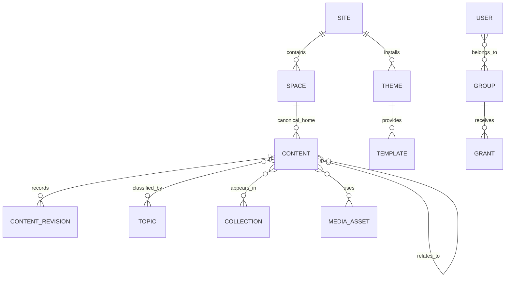
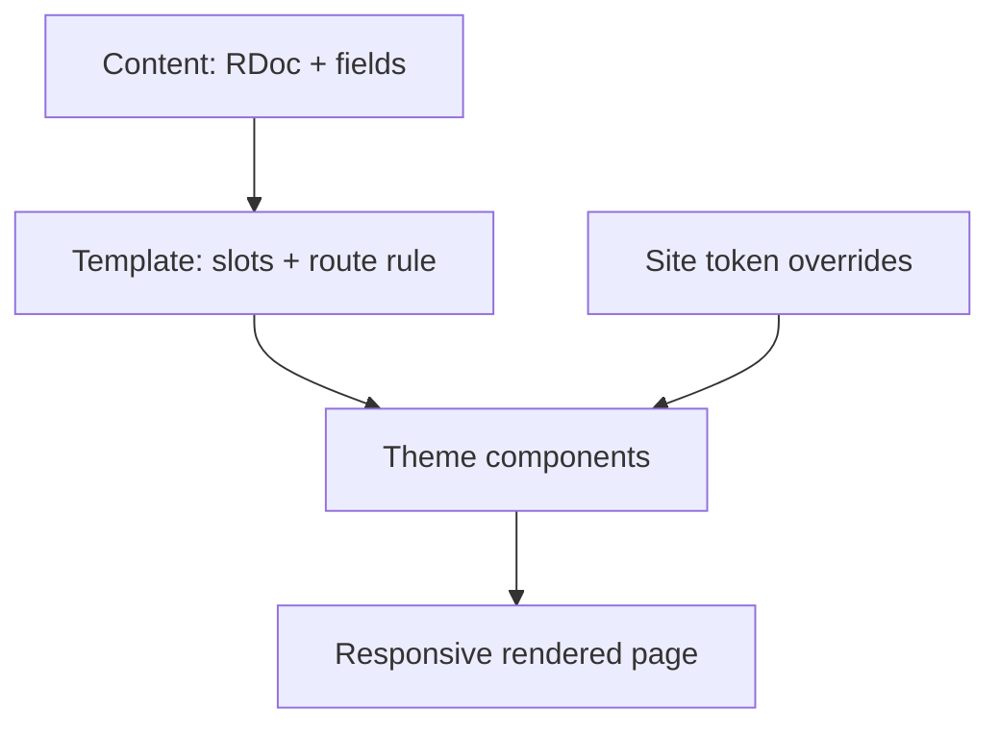

# Renegade CMS Architecture Report

**Decision:** build Renegade CMS as an open publishing operating system: a portable content core, a calm native application, and optional capability modules. It should be a _product with an internal grammar_, not a bundle of content types, plugins, and exceptions.

**Scope:** self-hosted first; ordinary VPS deployment; a native publishing UI; TypeScript/React implementation; future flagship instances may include Renegade Party, Foundation, and Civic Ledger. This report distinguishes product architecture from the details of its first implementation.

## 1. Executive summary and product thesis

Renegade CMS should make a simple promise: **put a thing somewhere, explain what it is, then decide who can change or display it.** A writer should only need to understand Space, Content, and Publish. Everything else is progressive disclosure.

The system must not copy WordPress’s accumulation of overlapping concepts. Its public nouns are deliberately few:

| Public noun | Meaning                                      | Not the same as          |
| ----------- | -------------------------------------------- | ------------------------ |
| Site        | one branded publication/application          | a deployment or database |
| Space       | a navigable home for work, e.g. News or Docs | a menu item              |
| Topic       | a reusable descriptive label/tree            | canonical location       |
| Collection  | a manual or rule-built presentation set      | a content type           |
| Content     | a publishable object with a schema           | only an article          |
| Template    | the rendering rule for a route/object        | the content itself       |

**Core decision:** every publishable thing is a Content Record with a type-specific schema and a structured document/fields. Forum threads, research profiles, episodes, and articles share identity, workflow, permissions, audit, media, search, and display plumbing. They get specialized behavior only where their actual interaction model differs.

This is feasible atop Payload + Next.js + Postgres. Payload is TypeScript-native, provides typed collections, access control, hooks, REST/GraphQL, and recommends Lexical for new rich-text builds; it also officially supports Postgres through its Drizzle adapter. [Payload concepts](https://payloadcms.com/docs/getting-started/concepts) [Payload databases](https://payloadcms.com/docs/database/overview) The product must nevertheless define its own database schema, APIs, events, and export format so a future move away from Payload does not require a content migration.

## 2. Design principles and non-negotiable constraints

1. **One calm default path.** New users create a Site, choose a starter, create Spaces, and write. No schema builder, plugin marketplace, or AI key is needed to reach a working site.
2. **Structured by default, escape hatches by permission.** Documents are semantic JSON. Raw HTML/JS never silently leaks into otherwise safe writing.
3. **Canonical home, many appearances.** Content belongs to one Space for ownership and URL identity, while collections, topics, entities, relationships, search, and navigation can surface it elsewhere.
4. **Content survives design.** A theme can be removed without breaking copy, headings, media, links, citations, or URLs.
5. **Visible ownership.** Export content, media manifest, configuration, theme source, and redirects from Settings at any time.
6. **Capability over job title.** Roles package permissions; permissions describe a concrete action, scope, and condition.
7. **Local-first operations.** The default Docker deployment requires only app, Postgres, and local media volume. Redis, object storage, real-time collaboration, search, and worker processes are add-ons.
8. **AI is a proposal engine.** It produces drafts with provenance, cost, and approval boundaries, never unpublished autonomous actions.

## 3. Findings from current systems

| System pattern        | What it gets right                     | Failure to avoid                                                     | Renegade response                                             |
| --------------------- | -------------------------------------- | -------------------------------------------------------------------- | ------------------------------------------------------------- |
| WordPress             | familiar writer path and ecosystem     | overlapping post/page/taxonomy/plugin concepts; page-builder lock-in | one Content Record, distinct public nouns, portable documents |
| Joomla/Drupal         | deep fields, permissions, and taxonomy | exposes implementation concepts too early                            | presets and “advanced setup,” not a blank schema form         |
| phpBB/forum admins    | clear trees, queues, scoped moderation | a separate account/content universe                                  | thread/reply module on shared users and governance            |
| headless CMS          | typed models and API discipline        | leaves users assembling their own publishing product                 | API-first **and** excellent native UI                         |
| block/page builders   | visual confidence                      | document layout becomes unportable component soup                    | semantic article body plus bounded template slots             |
| collaborative editors | live presence and conflict-free edits  | mandatory operational complexity                                     | local single-writer revisions first; collaboration optional   |

For the editor, Lexical, ProseMirror/Tiptap, and CKEditor are viable structured-editor families. Tiptap’s open-source Hocuspocus + Yjs route supports real-time collaboration and JSON/Yjs exports, but it warns that clients with different schemas can discard unknown content. [Tiptap collaboration overview](https://tiptap.dev/docs/collaboration/getting-started/overview) That makes real-time collaboration a later capability with explicit schema-version control, not an MVP dependency.

## 4. Recommended domain model and terminology

Keep the implementation schema richer than the public vocabulary:

- **Site:** independent publication boundary: hostname(s), default language, themes, members, policies, and exports.
- **Space:** owned tree node, e.g. `/news`, `/research/covid`, or `/community`. It has a parent, home template, publishing defaults, and scoped permissions. “Section” is the friendly label for a top-level Space; “category” is a nested Space. They are one entity.
- **Content Type:** a versioned field and document contract, e.g. Article, Page, Episode, Profile, Thread. Call it a “format” in the basic UI.
- **Content Record:** durable ID, title, slug, canonical Space, lifecycle state, structured body, typed fields, relationships, metadata, and published snapshot.
- **Topic:** an optional reusable taxonomy. Topics may have a tree but do not determine canonical URLs.
- **Collection:** a named set with `manual`, `rule`, or `hybrid` membership. Hybrid means pinned records plus a query. Collections power homepages, series, feeds, and related work without duplicating content.

Reject an unbounded generic entity-attribute-value model. It makes validation, queries, permissions, migrations, and exports ambiguous. Support custom Formats through schema definitions with versioned migrations, but use relational columns for universal fields and JSONB only for a format’s structured field payload.

## 5. Content organization and URL model

**Decision:** stable immutable IDs; human URLs are aliases, never database identities.

`/research/covid/vaccine-safety` resolves through `RouteAlias → ContentRecord`. Moving or renaming creates an automatic permanent redirect, preserves inbound links, and retains a route history. A published URL cannot be reallocated until the old alias is released deliberately. Archived content renders an archive notice and remains addressable unless policy says otherwise.

Navigation is a separate ordered tree of `NavItem`s: an item can point to a Space, Collection, Content Record, external URL, or query. This prevents the common mistake of making every menu alteration a content move.

### Example configurations

| Product         | Spaces                                 | Formats                          | Collections / special behavior           |
| --------------- | -------------------------------------- | -------------------------------- | ---------------------------------------- |
| Personal blog   | Essays, Notes, About                   | Article, Page                    | Featured, monthly archive                |
| Local newsroom  | News, Opinion, Guides, Community       | Story, Explainer, Profile        | live coverage, topic feeds, author pages |
| Documentation   | Guides, Reference, Releases            | Guide, Reference item, Changelog | version selector, next/previous rules    |
| Podcast network | Shows, Episodes, Articles              | Show, Episode, Article           | RSS feeds per show, season collections   |
| Civic research  | People, Organizations, Events, Reports | Profile, Event, Report, Claim    | evidence graph and timelines             |
| Community       | Community area Spaces                  | Thread, Reply, Announcement      | subscriptions, moderation queues         |

## 6. Editor and structured-document format

**Decision:** build on **Lexical**, initially through Payload’s Lexical integration, but define `RDoc` (Renegade Document) as a documented portable JSON schema with deterministic HTML and Markdown exporters/importers. Store the original document JSON, normalized plain text for search, and a rendered publish snapshot. HTML is an import/export format, not the source of truth.

Why Lexical: it is already the direction Payload recommends for new implementations, making the first release cheaper. Why not bind permanently to Lexical JSON: editor ASTs are implementation artifacts. `RDoc` needs a stable public node registry, migration versions, and round-trip tests.

**RDoc v1 nodes:** paragraph, heading, list, quote, code, table, divider, image, gallery, audio, video/embed card, document card, callout, citation, pull quote, timeline, reusable semantic block, and safe `html_fragment`. Inline nodes cover link, emphasis, strong, code, footnote, and annotation. Every block has an ID for comments, revisions, and accessibility findings.

| Editing level | Permission and experience                                                                  |
| ------------- | ------------------------------------------------------------------------------------------ |
| Write         | slash menu, paste cleanup, drag/drop, keyboard navigation, undo, accessible inspector      |
| Enhance       | reusable semantic blocks, citations, SEO/social fields, responsive media controls          |
| Source        | sanitized HTML fragment, custom classes from theme allowlist, anchor IDs, embed parameters |
| Developer     | registered node/plugin, template component, reviewed custom code                           |

Raw CSS belongs to theme/component packages. Raw JavaScript is never executable inside a document. A reviewed developer can register a sandboxed widget type with a JSON config schema. Sanitized custom HTML is allowed only to trusted roles and rendered under a restrictive CSP. This protects normal authors without stripping control from owners.

Collaborative editing is opt-in: Yjs/Hocuspocus service, short-lived signed access, schema compatibility gate, comments stored separately from RDoc, snapshots on workflow transitions. Offline merge and simultaneous editing are valuable but do not justify making every small VPS operate WebSockets from day one.

## 7. Media and embed architecture

Media is a first-class asset, not an attachment field.

`MediaAsset` stores original checksum, immutable original, derivatives, MIME/verified media type, dimensions/duration, transcription/caption links, alt text, credit, license, source URL, focal point, rights expiry, and derivative policy. Deduplicate originals by content hash within a Site while preserving per-use credit/alt/crop overrides.

**Embed decision:** URL discovery converts an approved provider URL into `EmbedRecord { provider, canonicalUrl, providerId, fetchedMetadata, privacyMode, params, fallback }`. Rendering uses a provider adapter and allowlisted parameters, not arbitrary iframe HTML. Persist a preview card and textual fallback so an article still makes sense if the provider disappears. Offer click-to-load for third-party embeds; it protects privacy and page performance.

Image delivery produces AVIF/WebP plus fallback, responsive `srcset`, fixed aspect-ratio boxes, lazy loading below the fold, and focal crops. Treat animated GIF as an upload accepted for compatibility but offer an MP4/WebM poster conversion because large GIFs are disproportionately expensive. Files are renamed server-side, stored outside the web root or in object storage, type-verified, size-limited, scanned, and served from a distinct media origin. OWASP specifically calls out publicly retrievable active uploads as an XSS/CSRF risk. [OWASP File Upload guidance](https://cheatsheetseries.owasp.org/cheatsheets/File_Upload_Cheat_Sheet.html)

## 8. Backend information architecture and user journeys

The six left-nav areas are correct:

| Area         | Default contents                                      | Advanced reveal                                  |
| ------------ | ----------------------------------------------------- | ------------------------------------------------ |
| Write        | new item, drafts, assigned work, templates            | source view, reusable blocks                     |
| Content      | all records, media, search, bulk edit                 | saved views, import/export                       |
| Organize     | Space tree, Topics, Collections, navigation           | redirects, relation rules                        |
| Review       | review queue, comments, changes, moderation           | audit/event log, embargoes                       |
| Design       | theme chooser, branding, templates                    | tokens, components, code packages                |
| Distribution | publication schedule, feeds, SEO, social, newsletters | API keys, syndication, ActivityPub               |
| Settings     | people, site settings, backups, integrations          | schemas, developer tools, deployment diagnostics |

The writer’s primary loop is: **Write → check warnings → submit/publish**. The editor’s loop adds **Review → schedule → distribute**. Owners obtain a “site control room” only after clicking an explicit advanced switch. Do not make advanced controls a global hidden setting: a user must be able to discover what is possible, just not be forced to process it while writing.

## 9. Permissions, workflow, revisions, and governance

Permission grants have five parts: `principal` (user/group), `action`, `resource kind`, `scope`, and `condition`. Example: `group=City desk; action=publish; kind=Content; scope=Space:news/san-antonio; condition=workflow_approved`.

Use deny-by-default, explicit grants, and an explain screen that can answer: “why can Sarah publish this but not change its template?” Groups may contain groups. Roles are reusable grant bundles, such as Writer or Community Moderator. Never hard-code these as the only roles.

Workflow is a versioned state machine per Format: Draft → In Review → Changes Requested/Approved → Scheduled → Published → Archived. A published record always points to one immutable revision. Review comments, attestations, legal hold, embargo, and approval gates are events; they must not overwrite history. Temporary grants have expiration and audit messages.

## 10. Theme, template, component, and design-token architecture

**Decision:** theme packages are versioned source packages with a manifest, token schema, component registry, templates, preview fixtures, migration notes, and compatibility range. A Site selects an active theme version and stores an explicit override layer.

Templates describe slots and rules, not editable freeform canvases. An Article template may provide `header`, `body`, `afterBody`, and `sidebar` slots; the article body remains RDoc. A visual designer may change token values, choose approved components, configure slots, and make a template variation. Developers make new components in TypeScript. This division keeps page freedom real while making a theme switch survivable.

**Import reality:** import WordPress posts/pages/taxonomies/media and most block content into RDoc with a conversion report. A classic WordPress theme can be semi-automatically analyzed for templates, CSS tokens, assets, and common patterns, but cannot be faithfully converted to React if it depends on PHP behavior or plugins. Page-builder pages are only reliably converted when mapped block-by-block; otherwise preserve them as sanitized legacy HTML plus a remediation queue. Ghost exports map well to posts/tags/members. Static HTML can import semantic body content, assets, and routes. React/Next code and Webflow output require human component mapping. Never promise “instant full theme conversion.”

## 11. Forum and community extension model

Model **Thread** as a Content Format and **Reply** as a specialized child record, not generic article blocks. Community behavior requires: high-write append paths, reply ordering/pagination, subscriptions, reactions, reports, rate limits, soft deletion, redaction, trust levels, anti-spam, and per-Space moderation. Those are a Community module with optimized tables and endpoints.

It still consumes shared identity, MediaAssets, capability grants, notification delivery, search, themes, audit log, APIs, and lifecycle. Threads can be rendered with the same template system but their reply stream should use purpose-built cursor pagination and never load the whole thread at once.

## 12. Self-hosting and operations architecture

**Base compose stack:** `web` (Next/Payload), `worker` (same image, separate process), `postgres`, and a bind-mounted media directory. Installation asks for domain, admin account, SMTP choice, database password, and backup destination. Provide a single health dashboard and a generated backup/restore command.

| Capability    | Base                       | Optional scale-up                        |
| ------------- | -------------------------- | ---------------------------------------- |
| Data          | Postgres                   | managed Postgres / read replica          |
| Media         | local volume               | S3-compatible storage                    |
| Cache/jobs    | in-process/simple DB queue | Redis                                    |
| Search        | Postgres FTS               | Meilisearch/OpenSearch adapter           |
| Email         | SMTP                       | provider adapter and delivery webhooks   |
| CDN           | none                       | any standards-compatible CDN             |
| Observability | health, structured logs    | OpenTelemetry/Sentry-compatible exporter |
| Collaboration | none                       | Hocuspocus/Yjs service                   |

Backups must include Postgres logical dump, media originals, theme packages, settings/secrets manifest excluding secret values, and application version. Test restore in CI and expose last backup/restore-test status. Upgrades run versioned database and RDoc migrations with dry-run, snapshot, progress, and rollback guidance. Managed hosting should run the exact same images/config format plus an operations control plane, never a proprietary product fork.

## 13. API, plugins, import/export, and migration strategy

Expose a documented REST API first, webhooks/event subscriptions, and generated TypeScript client; GraphQL is optional. Use API versioning at the contract level and scoped API tokens. Emit an append-only domain event stream: `content.created`, `revision.approved`, `asset.processed`, `route.changed`, etc.

Plugins come in three trust tiers:

1. **Integration adapters:** OAuth/API connections, no server code execution.
2. **Sandboxed extensions:** manifest + declarative fields/nodes/template configuration; restricted API.
3. **Trusted server packages:** installed by an owner, pinned/versioned/reviewable, declared permissions and migrations.

Export as a ZIP: JSONL records based on public schema, RDoc JSON, Markdown/HTML derivatives, media originals/manifest, redirects, taxonomy/relationships, theme source, and a machine-readable version manifest. Provide import diagnostics and mapping file support. This is the actual exit strategy, not merely a database dump.

RSS/Atom, sitemap, canonical URLs, Open Graph, JSON-LD, and standard feeds ship in core. Schema.org’s JSON-LD vocabulary should be generated from typed content and relationships, not manually pasted per page. [Schema.org overview](https://schema.org/)

## 14. Security, accessibility, privacy, and performance

Set **WCAG 2.2 AA** as the release gate. The W3C recommends WCAG 2.2 for new/updating work; it retains backward compatibility with earlier WCAG 2 versions. [WCAG 2.2](https://www.w3.org/TR/WCAG22/) Test the editor itself, admin UI, and rendered themes with keyboard, screen reader, zoom/reflow, and mobile touch flows.

- Editor linting warns but does not silently rewrite: missing alt text/captions, heading order, vague links, unlabeled tables, color-only meaning, and suspicious reading structure.
- Trusted HTML passes schema validation and sanitization; untrusted UGC is rendered in a stricter subset. CSP has per-render context with nonces and provider allowlists. CSP is a defense-in-depth measure, not a substitute for encoding/sanitizing. [OWASP CSP guidance](https://cheatsheetseries.owasp.org/cheatsheets/Content_Security_Policy_Cheat_Sheet.html)
- Use CSRF defenses, secure/session cookies, MFA/passkeys for owners, brute-force throttling, SSRF protections for URL fetching, malware scan/limits for files, permission tests, dependency lockfiles/SBOM, and signed release artifacts.
- Offer consent-aware, privacy-respecting analytics by default; do not load tracking scripts until consent where required.
- Establish performance budgets per starter theme. Cache published routes, precompute derivatives and metadata, stream/cache data boundaries, reserve media dimensions, and collect real-user performance. Core Web Vitals are intended to be measured by all site owners and surfaced across Google tools. [web.dev Web Vitals](https://web.dev/articles/vitals)

## 15. AI integration architecture

Create an `AI Gateway` interface, not a provider-specific feature layer:

`Task request → policy check → redaction/context selection → provider adapter → structured proposal → human review → accepted change/audit event`.

Tasks declare allowed data classes, maximum tokens/cost, timeout, model requirements, and whether network use is allowed. BYO keys remain encrypted per Site; managed usage is separately metered. Private drafts are excluded unless the initiating user is authorized and explicitly includes them.

Every response shows source context, model/provider, timestamp, estimated cost, and its destination. AI can draft alt text, summary, metadata, translation, topic suggestions, migration maps, related links, and moderation triage. It cannot publish, delete, change permissions, execute code, or send communications without a separate human action. Log acceptance/rejection so recommendations improve without turning unpublished material into provider training data by default.

## 16. Concrete entities and relationships

| Entity       | Key fields                                          | Relationships                             |
| ------------ | --------------------------------------------------- | ----------------------------------------- |
| Site         | id, hosts, locale, policy, active_theme             | spaces, memberships, integrations         |
| Space        | site_id, parent_id, slug, defaults                  | content, grants, navigation               |
| ContentType  | id, version, field schema, workflow                 | content records, templates                |
| Content      | site_id, type_id, canonical_space_id, status, slug  | revisions, topics, collections, relations |
| Revision     | content_id, rdoc, fields, author, hash              | comments, approvals                       |
| RouteAlias   | site_id, path, target, redirect status              | content/collection/space                  |
| Collection   | membership mode, rule AST, order                    | content items                             |
| Topic        | site_id, parent_id, slug                            | content joins                             |
| MediaAsset   | checksum, storage key, metadata                     | media uses/derivatives                    |
| Theme        | package/version/manifest                            | templates, tokens                         |
| Grant        | subject, action, resource scope, condition, expires | user/group/site                           |
| AuditEvent   | actor, action, target, before/after hash            | immutable log                             |
| Notification | recipient, channel, event, state                    | subscriptions                             |

Postgres is the recommended durable system of record because Renegade’s roadmap has many relationships, transactions, scoped grants, queryable audit history, and reporting needs. JSONB is appropriate for RDoc and versioned custom fields, not as a replacement for relational integrity.

## 17. Recommended technical stack and alternatives

| Layer     | Recommendation               | Rejected / deferred alternative  | Reason                                                                  |
| --------- | ---------------------------- | -------------------------------- | ----------------------------------------------------------------------- |
| App       | Next.js + React + TypeScript | bespoke frontend framework       | strong ecosystem and first-class React templates                        |
| CMS host  | Payload initially            | build all admin primitives first | accelerates typed CRUD/admin/auth but retain a Renegade domain boundary |
| DB        | PostgreSQL                   | Mongo as primary                 | relational governance/relationships/export queries dominate             |
| Editor    | Lexical + RDoc abstraction   | editor JSON as public format     | lower implementation cost, avoids vendor/editor lock-in                 |
| Search    | Postgres FTS initially       | OpenSearch on every VPS          | simple install; adapter when scale/semantic need appears                |
| jobs      | DB-backed worker initially   | Redis mandatory                  | reduces required services                                               |
| media     | local volume with S3 adapter | forced cloud storage             | self-hosting and inexpensive first install                              |
| real time | optional Yjs/Hocuspocus      | always-on CRDT                   | valuable but operationally nonessential                                 |

Payload is sufficient as a substrate, but not as the product’s architecture. Isolate it behind `RenegadeRepository`, `PolicyEngine`, `RDoc`, `RenderContract`, and `ExportContract` packages. No theme, plugin, or public integration directly imports Payload internals.

## 18. MVP that proves the architecture

The MVP is not a toy blog. It proves the difficult separations:

1. Docker install with app, Postgres, local media, SMTP and backups.
2. Site, nested Spaces, Topics, manual/hybrid Collections, navigation separate from hierarchy.
3. Article/Page/Basic Profile formats, RDoc writing, media library, safe YouTube embed, revisions, publish/schedule/archive.
4. Writer/Editor/Owner role bundles implemented through real capability grants and Space scopes.
5. One polished responsive starter theme, tokens, Article/Page templates, and no-code branding controls.
6. Redirect-safe moves, RSS/sitemap/OG/JSON-LD, export ZIP, and import of Markdown/WordPress WXR basics.
7. WCAG 2.2 AA test baseline, CSP/sanitization/upload protection, health and backup-restore verification.

Exclude forum replies, real-time coauthoring, visual component creation, marketplace, multi-site tenants, native mobile app, full AI suite, and generalized arbitrary custom schemas from MVP.

## 19. Phased roadmap

| Phase                     | Outcome                                                                     | Gate                                                           |
| ------------------------- | --------------------------------------------------------------------------- | -------------------------------------------------------------- |
| 0: contracts              | public entities, RDoc, export, policy grammar                               | architecture tests and migration strategy signed off           |
| 1: publishing MVP         | above MVP                                                                   | install, publish, move, export, restore work on a $10–20 VPS   |
| 2: editorial depth        | review assignments, annotations, custom Formats, richer media, AI gateway   | 5-person newsroom workflow works without developer involvement |
| 3: design system          | visual templates, components, theme SDK, semi-automated imports             | theme switch leaves content and routes intact                  |
| 4: community/distribution | Forum module, notifications, social/feed integrations, optional ActivityPub | abuse and load testing pass                                    |
| 5: scale/managed          | multi-site, workers, search adapters, managed plane                         | same export/import works between self-hosted and managed       |

ActivityPub is a credible later distribution option because it is a W3C decentralized social networking recommendation with client-to-server and server-to-server activity flows. [ActivityPub specification](https://www.w3.org/TR/activitypub/) It is not MVP scope.

## 20. Risks, tradeoffs, and deferred decisions

| Risk                               | Why it happens                                  | Mitigation / decision                                                      |
| ---------------------------------- | ----------------------------------------------- | -------------------------------------------------------------------------- |
| Building a competitor to every CMS | scope expands through plugins                   | ship one coherent publishing core; module proposals need a shared-core fit |
| Payload coupling                   | convenience leaks into product APIs             | adapters/contracts and export tests from day one                           |
| visual-builder lock-in             | freeform layout writes into content             | bounded slots and semantic RDoc                                            |
| permission complexity              | grants become invisible                         | explanation UI, presets, tests, deny-by-default                            |
| CRDT schema corruption             | incompatible live clients discard unknown nodes | version gates, migrations, defer collaboration                             |
| theme supply chain                 | executable packages can compromise sites        | signed/pinned packages, explicit trust tiers, SBOM                         |
| “AI magic” damages trust           | hidden edits/cost/data export                   | proposal-only workflow and provenance                                      |

Defer: plugin marketplace governance, billing, cross-site federation, GraphQL as a required API, block-level real-time comments, arbitrary browser-side code, global multi-tenant control plane, and full WordPress-theme conversion. Each is a product/business commitment, not an engineering checkbox.

## 21. Renegade CMS operating model

The same underlying system changes its surface, not its truth:

- **Writer:** opens a template, writes an RDoc, receives clear accessibility/metadata prompts, and submits.
- **Editor:** manages Spaces, Collections, assignments, review gates, schedules, and public corrections.
- **Owner:** selects a theme, changes brand tokens, sees backup/export status, grants limited access, and owns every artifact.
- **Developer:** defines a new Format, node, component, adapter, or trusted extension through versioned contracts.
- **Community moderator:** works a scoped queue of reports/replies and can act only in their area.

That is the operating model worth protecting: a normal writer sees a publishing application; an owner sees an understandable system; a developer sees a composed platform. None of them has to pretend the other layer does not exist.

## Immediate architecture decisions to ratify

1. Postgres is canonical; Payload is the initial host, not the permanent domain boundary.
2. `Space` is the single nested location entity; “section” and “category” are interface labels.
3. `Collection` supports manual, rule, and hybrid membership; navigation is separate.
4. `RDoc` is portable semantic JSON; HTML/Markdown are import/export views.
5. Theme packages and templates are first-class, versioned, content-independent assets.
6. Capability grants are the source of truth; fixed roles are merely presets.
7. Base self-hosting requires no Redis, cloud storage, AI, or collaboration server.
8. The first release proves ownership with export and restore, not a marketplace.
