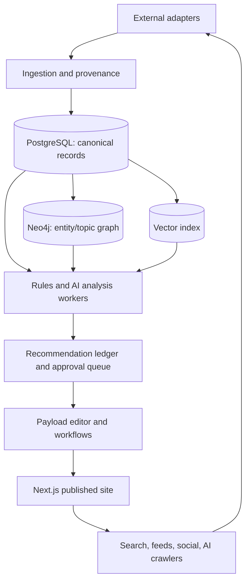

# AI SEO & Content-Discovery Engine for a Modern CMS

**Research cut-off:** 10 August 2026. **Design stance:** human-controlled, AI-assisted; evidence-backed recommendations; self-hostable core; adapters for commercial data.

## 1. Executive summary

Build a **Content Discovery and Authority Engine**, not a keyword generator or a red-light plugin. It is a publication-level decision system:

`discover demand → understand SERP/answer landscape → map against the publication's evidence and knowledge → propose original work → verify and publish → measure discovery and audience value → learn → propose the next action.`

The durable advantage is not predicting Google's hidden algorithm. It is maintaining unusually good first-party evidence, entity clarity, technical accessibility, topic coverage, source provenance, and a feedback loop that proves which improvements actually help readers. Search systems change; these assets retain value in Google, Bing, AI answers, feeds, social discovery, direct audience, and agentic browsing.

The correct initial architecture is a modular monolith around the existing **Next.js + Payload + PostgreSQL** application. Neo4j is useful for the knowledge graph; Redis/queue workers coordinate jobs. Keep crawling, embeddings, and expensive AI work on the home server; the public VPS serves pages and lightweight APIs. Every external provider sits behind an adapter. AI proposes; deterministic validators and human review decide consequential changes.

## 2. 2026 search landscape

Google's May 2026 guidance materially clarifies the landscape. AI Overviews and AI Mode use pages from the normal Search index through retrieval-augmented generation (RAG), then use **query fan-out** to seek related evidence. A page must be indexed and eligible for a normal snippet to be eligible. Google calls AEO/GEO part of SEO, not a separate magic discipline, and says its Generative AI performance report in Search Console is the measurement surface. [Google, 15 May 2026](https://developers.google.com/search/docs/fundamentals/ai-optimization-guide)

The old mental model was “choose a keyword, write a page, add a few links.” The current model is “make reliable, crawlable, distinct information available in a format that satisfies a real information need across many discovery surfaces.” Clicks are no longer the sole output. A publisher also needs attributable citations, branded recall, subscriptions, feed/social distribution, and repeat visits.

Google continues to state that its systems rank pages using many signals, largely at page level, with site-wide signals/classifiers also contributing. It explicitly warns that good site-wide signals do not make every page rank. [Google ranking systems guide](https://developers.google.com/search/docs/appearance/ranking-systems-guide) That means “topical authority” is a useful planning concept, not a single documented site score.

## 3. Confirmed factors, evidence levels, and myths

| Class                           | What the engine should treat as true                                                                                                                                                                                                            | Design consequence                                                                                                                        |
| ------------------------------- | ----------------------------------------------------------------------------------------------------------------------------------------------------------------------------------------------------------------------------------------------- | ----------------------------------------------------------------------------------------------------------------------------------------- |
| **Confirmed**                   | Crawlability, index eligibility, snippets, technical Search requirements, people-first useful content, spam compliance, and relevant page quality matter to Google eligibility and visibility.                                                  | Pre-flight every publication; never recommend an indexable page that fails policy/technical gates.                                        |
| **Confirmed**                   | Google uses links in ranking systems; internal links and crawlable navigation aid discovery. Structured data helps it understand content and can make a page eligible for rich results, but does not guarantee them.                            | Maintain an internal-link graph; generate JSON-LD only from visible source fields.                                                        |
| **Confirmed**                   | E-E-A-T is not one ranking factor; Google says it gives greater weight to strong E-E-A-T signals for YMYL. Quality-rater judgments are not direct ranking inputs.                                                                               | Store author experience, sources, corrections, and provenance; never show an invented “E-E-A-T score.”                                    |
| **Confirmed**                   | AI-generated content is not prohibited by origin, but scaled generation without user value can violate scaled-content-abuse policy.                                                                                                             | Drafting is assisted; publishing requires evidence/originality/review gates.                                                              |
| **Confirmed**                   | ChatGPT Search can surface public sites; inclusion in summaries/snippets requires allowing `OAI-SearchBot`. GPTBot is a separate control.                                                                                                       | Test robots policy for each OpenAI bot and record it by domain/version.                                                                   |
| **Strong but not causal proof** | Clean information architecture, relevant internal links, credible inbound references, original data, good UX, and freshness when the subject changes repeatedly correlate with stronger performance and are consistent with documented systems. | Weight these as diagnostics and opportunities, not guaranteed ranking levers.                                                             |
| **Unproven/variable**           | Passage design, headings, concise definitions, tables, author/entity pages, and citations may improve retrieval/citation in some systems.                                                                                                       | A/B or repeated-observation test by platform; label as hypothesis.                                                                        |
| **Folklore to reject**          | Fixed word counts, keyword density targets, domain-authority scores as Google metrics, mandatory FAQ schema, forced “AI chunks,” `llms.txt` for Google, and universal AI-citation hacks.                                                        | Do not expose them as scores. Google explicitly says it ignores `llms.txt`, requires no special chunking, and needs no special AI markup. |

Sources: [Google helpful content](https://developers.google.com/search/docs/fundamentals/creating-helpful-content), [Search Essentials](https://developers.google.com/search/docs/essentials), [spam policies](https://developers.google.com/search/docs/essentials/spam-policies), [structured-data guidelines](https://developers.google.com/search/docs/appearance/structured-data/sd-policies), [Google AI guidance](https://developers.google.com/search/docs/fundamentals/ai-optimization-guide), [OpenAI publisher FAQ](https://help.openai.com/en/articles/12627856-publishers-and-developers-faq).

## 4. AI search / GEO findings

**Known:** Google says its generative features ground answers with its normal index and related fan-out queries. It recommends unique, non-commodity, first-hand content, crawlability, normal technical SEO, relevant media, and user satisfaction. It says not to create separate pages for every fan-out phrase; that can be scaled-content abuse. ChatGPT Search presents cited web sources and permits site owners to control search crawling through `OAI-SearchBot`. [Google](https://developers.google.com/search/docs/fundamentals/ai-optimization-guide), [OpenAI](https://developers.openai.com/api/docs/bots)

**Not known:** No public engine reveals its retriever/reranker weights, exact citation-selection algorithm, or a reliable citation API. Search results may vary by prompt wording, location, account, time, index state, and model run. Google Search Console measures Google's generative performance, not all answer engines. “AI citation share of voice” must be labelled **sampled observation**, never a census.

**Practical GEO definition:** make a claim easy to verify, uniquely worth retrieving, accurately attributable, accessible to crawlers, and connected to its authoritative context. Use clear headings, direct answers where a direct answer helps a reader, cited primary sources, labeled dates, accessible tables, stable URLs/fragments, author and organization context, original data/tools/media, and corrections. Do this for readers first. A 2026 survey finds evidence supports effects _after a source is already in a controlled context_, but not stable cross-platform causal gains in organic discoverability. Treat academic GEO experiments as promising but narrow. [Martinez, 2026 preprint](https://arxiv.org/abs/2607.14035)

## 5. Proposed system architecture

**Contracts to freeze now**

- Canonical IDs: UUID/ULID for every document, revision, entity, claim, source, query, observation, recommendation, experiment, and external provider record.
- Provenance: every extracted fact/edge has source URL, retrieval timestamp, extractor version, evidence span/hash, confidence, and review status.
- Lifecycle: `draft → proposed → human-reviewed → scheduled → published → superseded/archived`; a crawler or LLM never writes directly to `published`.
- Idempotency: `(provider, external_id, observed_at/window)` unique keys; immutable raw payload storage; retries are safe.
- Provider contract: `capabilities()`, `health()`, `fetch()`, normalized output, raw-payload reference, rate/cost metadata, and deletion/retention policy.

## 6. Agent architecture and approval boundaries

| Agent/service            | Inputs → outputs                                                          | Automation boundary                                                         |
| ------------------------ | ------------------------------------------------------------------------- | --------------------------------------------------------------------------- |
| Opportunity researcher   | queries, trends, graph gaps, GSC → opportunity hypotheses                 | safe to create research cards only                                          |
| SERP observer            | licensed/API SERP snapshots → features, domains, intent evidence          | safe collection subject to provider terms                                   |
| Intent/entity resolver   | queries/articles → intent family, entities, ambiguity                     | proposes; unresolved entity merges require review                           |
| Brief builder            | research card + sources + graph → evidence-first brief                    | safe draft; never direct publish                                            |
| Information-gain critic  | draft + competitive/source corpus → distinct contributions, missing proof | advisory only                                                               |
| Claim/citation verifier  | claim spans + sources → entailment, source tier, staleness                | can block publish under policy; human resolves disputed evidence            |
| Internal-link planner    | graph + page text → contextual link candidates                            | suggestion only; bounded auto-fix for broken internal URLs                  |
| Schema compiler          | typed visible CMS fields → JSON-LD + validation                           | automatic generation; changes to editorial facts require approval           |
| Technical auditor        | render, crawl, headers, sitemap → defects                                 | can regenerate sitemaps; no redirects/deindexing without approval           |
| Performance analyst      | GSC, analytics, experiments → explanations/action candidates              | reports and alerts safe; changes require approval                           |
| Decay/competitor monitor | observations, revisions, sources → update/merge/prune cases               | human approves substantial edits, redirects, deletes                        |
| AI visibility sampler    | prompt panel across engines → cited URLs/answer claims                    | sampled measurements only; no deceptive probing or terms-violating scraping |

All agents use a shared tool gateway that strips scripts/HTML, treats crawled pages as hostile text, quarantines instructions in external pages, and requires source spans for claims. This prevents prompt injection from turning a competitor page into an agent instruction.

## 7. Data model

**PostgreSQL canonical tables:** `documents`, `document_revisions`, `content_blocks`, `authors`, `organizations`, `entities`, `entity_aliases`, `claims`, `claim_evidence`, `sources`, `citations`, `queries`, `intent_clusters`, `serp_snapshots`, `ranking_observations`, `search_performance_daily`, `analytics_daily`, `crawl_observations`, `schema_artifacts`, `link_edges`, `recommendations`, `recommendation_outcomes`, `experiments`, `experiment_variants`, `provider_runs`, `raw_artifacts`, and `audit_log`.

Important fields include: stable ID; canonical URL; locale; content type; publish/update/effective dates; author and reviewer IDs; `index_policy`; source tier; evidence quote/span; source retrieval/publication date; entity IDs/aliases; embedding model/version; content hash; revision parent; recommendation evidence links; expected impact range; confidence _and reason_; status; approval actor/time.

**Neo4j graph:** nodes `Page`, `Revision`, `Topic`, `Question`, `QueryCluster`, `Entity`, `Claim`, `Source`, `Author`, `Media`, `Dataset`, `Experiment`. Typed edges include `MENTIONS`, `ABOUT`, `ANSWERS`, `SUPPORTS`, `CONTRADICTS`, `CITES`, `AUTHORED`, `LINKS_TO`, `DUPLICATES`, `SUPERSEDES`, `PART_OF_CLUSTER`, and `OBSERVED_FOR`. Every edge stores provenance/review state. Keep ranking facts in Postgres, not the graph.

**Vector index:** start with PostgreSQL `pgvector`; index approved page sections, query clusters, brief evidence, and semantic duplicates. Move to Qdrant only if measured vector load/latency needs it. Hybrid retrieval is lexical + vector + filters, not embeddings alone.

## 8. Knowledge-graph uses

The graph is a CMS intelligence primitive, not a public claim of “authority.” It enables: orphan-page and crawl-depth detection; suggested hub/supporting pages; entity disambiguation; schema `sameAs`/`@id` consistency; evidence-aware related content; source/citation reuse; duplicate/cannibalization review; coverage maps; and document-grounded internal RAG. It does **not** create ranking power by existing.

## 9. Content creation workflow

1. Ingest opportunity signals and cluster queries by underlying need, not keyword string.
2. Show intent distribution: informational, navigational, commercial investigation, transactional, comparison, troubleshooting, definition/explanation, news, research, or commentary. Preserve multi-intent ambiguity.
3. Create a research card: demand evidence, SERP/answer observations, existing site coverage, entities, audience/commercial value, freshness requirement, and authority/evidence requirements.
4. Generate a brief that names the user's job, required questions, competitor blind spots, internal links, primary sources/datasets, candidate visuals, supported schema, and **a proposed distinct contribution**.
5. Writer drafts from evidence. The editor highlights unverified claims, semantic duplication, internal cannibalization, bare assertions, stale figures, missing entity context, and unsupported schema.
6. Claim verifier checks citation entailment. The information-gain critic asks what is original: data, calculation, experiment, expert analysis, synthesis, historical comparison, tool, or specific first-party experience.
7. Human approves content, factual claims, editorial judgment, and publish state; CMS compiles metadata, JSON-LD, feeds, sitemap delta, and IndexNow event where applicable.

## 10. Post-publication workflow

At publish: render as a bot would; validate canonical/robots/meta/JSON-LD/links; emit sitemap `lastmod` only for meaningful changes; submit/update through supported channels. Collect Search Console and Bing data daily, analytics continuously, and technical crawl snapshots on a risk schedule. Detect evidence/date/link changes, not just traffic loss. Produce a reviewable update proposal with a content diff and source delta; preserve all revisions.

Google removed the unauthenticated sitemap ping endpoint. Use sitemaps/robots.txt and Search Console; use IndexNow for engines that support it. [Google, 2023](https://developers.google.com/search/blog/2023/06/sitemaps-lastmod-ping), [IndexNow protocol](https://www.indexnow.org/documentation)

## 11. Transparent scorecard, not an SEO number

Show separate 0–100 diagnostics with evidence and a “not applicable” state:

- **Technical eligibility (hard gate):** % canonical/indexable/renderable URLs without severe error; do not average it away.
- **Intent satisfaction:** verified required questions/steps covered, GSC query-to-section gaps, on-page helpfulness review. Never infer solely from word count.
- **Evidence integrity:** weighted share of material claims with supporting sources; source tier, entailment, date, and correction status.
- **Information gain:** weighted verified distinct contributions: first-party data, original calculation/tool, experiment, expert evidence, synthesis, unique media. Human can override with rationale.
- **Entity/topic coverage:** graph coverage of needed entities/questions and lack of redundant near-duplicates.
- **Discovery readiness:** internal crawl paths, schema validity, feeds/media accessibility, metadata, citations, and bot permissions.
- **Freshness fitness:** age relative to subject volatility; broken/outdated evidence; never require freshness for stable historical work.
- **Audience value:** engaged reads, return rate, subscriptions/conversions, completion, and editorial goal, segmented by intent.

Never combine these into a fake universal score. If a single health index is needed, publish the component weights and exclude dimensions with insufficient evidence.

## 12. SEO Action Queue algorithm

Rank actions by a transparent expected-value range:

`priority = impact potential × confidence × strategic relevance × reversibility × time sensitivity ÷ estimated effort`

Impact potential is a range from observed impressions/rank band/CTR gap/conversion value, crawl blockage, breadth of affected URLs, and topic dependency. Confidence is evidence strength: confirmed issue > repeated site observation > provider/SERP evidence > hypothesis. Strategic relevance reflects declared audience/mission, not only volume. Penalize actions that risk policy, truth, UX, or cannibalization. Every card exposes inputs, sources, counterfactual, and why it is not certain.

Examples: a `noindex` error on a cornerstone page is high-confidence/high-urgency. “Add this keyword 12 times” is rejected. A page with impression/query evidence that it misses a directly requested answer becomes an experiment/proposed update, not an automatic rewrite.

## 13. Integration menu

Pricing changes frequently: use this as a procurement shortlist, confirm current pricing and terms before connecting.

| Capability              | Recommended adapters                                                | API / pricing / limits                                                                                                                                         | Open/self-hostable option                                                                            |
| ----------------------- | ------------------------------------------------------------------- | -------------------------------------------------------------------------------------------------------------------------------------------------------------- | ---------------------------------------------------------------------------------------------------- |
| Google visibility       | Search Console Search Analytics, URL Inspection, bulk export        | Official APIs; no per-call price, quota/property permissions; data is sampled/limited and not real-time. [Docs](https://developers.google.com/webmaster-tools) | store exports in Postgres/ClickHouse later                                                           |
| Bing visibility         | Bing Webmaster Tools, URL/Content submission                        | account/API availability varies; IndexNow supported.                                                                                                           | sitemap + IndexNow                                                                                   |
| URL change notification | IndexNow                                                            | free protocol; only participating engines, not Google. [Docs](https://www.indexnow.org/documentation)                                                          | simple internal publisher adapter                                                                    |
| SERP/keyword snapshots  | DataForSEO, SerpApi, Semrush, Ahrefs                                | commercial, usually credit/usage pricing; SERP features/localization vary; abide terms, do not scrape Google directly.                                         | limited compliant in-house crawler only where permitted; no substitute for licensed Google SERP data |
| Backlinks               | Ahrefs, Semrush, Majestic, Moz                                      | proprietary indexes, subscription/API add-ons, incomplete by definition.                                                                                       | Common Crawl link graph is delayed/incomplete                                                        |
| Trends                  | Google Trends API alpha, Google News/RSS, GSC, licensed social APIs | Trends access/terms are limited; social data is platform-limited. [Google announcement](https://developers.google.com/search/blog/2025/07/trends-api)          | RSS, curated source lists, event clustering                                                          |
| Analytics               | GA4 Data API; Plausible/Matomo/PostHog                              | GA4 free tier/quotas; self-hosted products need ops.                                                                                                           | Matomo/Plausible/PostHog                                                                             |
| LLM / verification      | OpenAI Responses API, Gemini, Qwen-compatible, local models         | token pricing, model behavior, privacy vary; require provider adapters and caching.                                                                            | Ollama/vLLM + approved open model for extraction/classification                                      |
| Embeddings/vector       | provider embeddings; pgvector/Qdrant                                | low cost but re-embedding is a migration cost.                                                                                                                 | pgvector first, Qdrant later                                                                         |
| Web quality             | Lighthouse/CrUX, Playwright, axe-core                               | Lighthouse/axe open; CrUX has coverage limits.                                                                                                                 | all self-hostable                                                                                    |
| Schema                  | Schema.org vocabulary, Google Rich Results Test                     | Schema.org is an open vocabulary; Google supports only documented rich-result features.                                                                        | JSON Schema/SHACL-style internal validators                                                          |

Do not make a product claim that a vendor's domain-authority metric is a Google ranking factor. Provider data is evidence for prioritization, not ground truth.

## 14. Technical SEO engine

Build deterministic checks first: canonical policy, route/slug uniqueness, HTTP status, redirect chain/loop, robots directives, sitemap membership, XML validity, pagination/hreflang when real, malformed metadata, duplicate/canonical conflict, broken internal links, orphan/crawl-depth, rendered versus source content, mobile viewport, images/alt/captions, Open Graph, RSS/Atom, JSON-LD validity, and CWV/Lighthouse evidence. The CMS can automatically generate canonical tags, sitemaps, feeds, `lastmod`, structured-data artifacts, and safe broken-link reports. It must request approval for redirects, `noindex`, canonicals that change ownership, content deletion/merges, and any factual metadata.

Use SSR or prerendered HTML as the default for public editorial content. JavaScript is supported, but Google says JS SEO is more complex; do not make crawlability depend on client-only rendering. [Google AI guide](https://developers.google.com/search/docs/fundamentals/ai-optimization-guide)

## 15. AI-search visibility engine

1. **Eligibility layer:** bot permissions (`OAI-SearchBot` separately from `GPTBot`), public/crawlable render, snippet controls, normal index status, citation-friendly source pages, and page-level provenance.
2. **Observation layer:** a versioned prompt panel by topic/intent, repeated runs, locales when legitimate, raw answer/citation capture, cited URL/domain, answer claim, engine/model/time, and source position where visible.
3. **Analysis layer:** citation share (sampled), coverage by topic, missing entity/claim opportunities, cited competitor comparison, and repeatability interval. Do not imply unobserved citations did not happen.
4. **Improvement layer:** recommend evidence/source/coverage/media improvements that benefit readers. Never rewrite simply to chase a sampled citation.

Google's report is the authoritative channel for Google generative performance; ChatGPT has crawler controls/citations but no publisher citation-performance API publicly documented. Perplexity/Copilot/Gemini measurement should be marked “third-party sampled.”

## 16. Content intelligence engine

The system forms query clusters with hybrid lexical + embedding retrieval, then uses LLM classification with retrieved SERP evidence. It stores alternatives, model/version, and confidence. It compares candidate briefs against both the publication corpus and permitted competitor extracts. “Information gain” is a reviewable claim: identify exactly what the page adds, who validates it, and where it appears. It should detect AI slop with: near-duplicate embeddings + shingles; section-template repetition; unsupported/uncited material claims; citation-to-claim non-entailment; source laundering; too-many vague abstractions; fictitious figures; and generic content that adds no new decision, evidence, or experience. None of these are automatic truth detectors; they are escalation signals.

## 17. Internal link and topic graph engine

Candidate link scoring combines semantic relevance, graph relationship, source/target intent, anchor phrase naturalness, target health/indexability, source-page prominence, link-count budget, and current crawl depth. Suggest only contextual links that explain something useful. Check the graph for hub absence, dangling clusters, duplicate hubs, weak source-to-supporting coverage, and orphan pages. Use graph maps in the CMS for planning, but never manufacture a link just to distribute “authority.”

## 18. Competitive intelligence engine

Use a licensed SERP provider to collect snapshots, then compare: query/intent coverage, SERP feature mix, content type, freshness, entities/questions answered, cited primary sources, original assets, format, internal cluster architecture visible from public pages, and measured backlinks/mentions. Its output must state “possible explanatory differences,” not causal verdicts. Never ingest competitor prose for imitation; store only the minimum permitted excerpt/features and link to the original.

## 19. Measurement and experimentation

An experiment record includes hypothesis, affected URLs, variants, pre-period, control cohort matched by query/page type, primary metric, guardrails (engagement/corrections/conversion), power/duration target, external-event notes, and rollback. SEO tests are difficult because Google chooses exposure and query mix changes. Favor switchback/time-series methods, matched cohorts, or staged rollouts; avoid declaring victory from a one-week position change. Keep a holdout where possible. For titles, change one variable, preserve page meaning/URL, wait through a predeclared window, and use impressions/clicks/CTR plus downstream value—not CTR alone.

## 20. CMS experience

**Dashboard:** four cards only: What changed? Why might it have changed? Highest-value next action? What needs approval? Drill-down reveals evidence, not 400 warnings.

**Editor:** intent and unanswered-question coverage; entity panel; source/claim ledger; information-gain statement; internal links; competing internal pages; schema preview; rendered bot preview; technical preflight; revision diff. “SEO readiness” is a checklist by evidence category, never a green light that pretends editorial quality is solved.

**Alerts:** indexability regressions, sudden impression/click loss after significance checks, crawl failures, source decay, broken citations, policy-risk patterns, and experiment end-of-window—not minor metadata noise.

## 21. Automation boundaries and security

Safe automation: crawl reports, broken-link detection, sitemap/feed regeneration, schema compilation from approved fields, queue creation, monitoring, and draft recommendations. Suggested change: titles/meta, links, schema additions, content brief, claim/source replacements, and refresh diffs. Human approval: publish, factual assertions, substantive rewrites, redirects/canonicals/noindex, merges/deletes, author credentials, outreach, and policy overrides.

Security controls: outbound allowlists; SSRF prevention; rate limiting; encrypted provider credentials; least-privilege OAuth; signed webhooks; immutable raw evidence; content sanitization; no execution of scripts from crawls; treat webpage/PDF text as untrusted prompts; model/tool permissions per agent; citation URL allow/deny policies; anomaly detection for fake backlinks/analytics; audit log and rollback; separate public rendering from worker network.

## 22. Cost model (monthly, indicative)

| Scale        | Core hosting/ops |        Data/AI | Expected range and policy                                                                                                                       |
| ------------ | ---------------: | -------------: | ----------------------------------------------------------------------------------------------------------------------------------------------- |
| 1k–10k pages |          $30–150 |        $50–500 | Postgres + pgvector + Redis, scheduled lightweight audits, GSC/Bing/IndexNow, cached embeddings; purchase only a small SERP/backlink allowance. |
| 10k–100k     |         $150–700 |     $500–3,000 | dedicated workers/object storage/observability; paid SERP/backlink data becomes dominant; batch embed/update; use small models for extraction.  |
| 100k+        |      $700–4,000+ | $3,000–20,000+ | partitioned data/warehouse, queues, content-crawl budget, data-provider contracts, selective frontier-model reviews.                            |

Use deterministic code for URL/schema/link checks; small/local models for classification/extraction; embeddings only when a document/query changes; cached SERP snapshots; frontier reasoning models only for complex briefs, contested claim review, and diagnosis. LLM spending without a decision or human-facing artifact is a defect.

## 23. Roadmap and proof gates

| Phase                        | Features and dependencies                                                                                                                                             | Difficulty / expected value | Acceptance gate                                                                                          |
| ---------------------------- | --------------------------------------------------------------------------------------------------------------------------------------------------------------------- | --------------------------- | -------------------------------------------------------------------------------------------------------- |
| **1. Foundation**            | canonical content model, revisions/provenance, SSR/metadata/sitemaps/RSS/robots, GSC+Bing/IndexNow adapters, technical crawler, editor preflight, basic GSC dashboard | medium / highest            | publish ten real articles; prove indexed/crawlable pages, source ledger, and action queue from real data |
| **2. Intelligence**          | pgvector, entity/topic graph, intent clusters, internal-link suggestions, briefs, claim/citation checks, information-gain review                                      | high / high                 | one topic cluster planned, written, reviewed, and graph-linked without unsupported claims                |
| **3. Continuous automation** | decay/cannibalization, change monitoring, experiments, competitor adapters, outcome memory, proposal diffs                                                            | high / high                 | system detects and safely proposes a real refresh; outcome is recorded after approval                    |
| **4. Frontier**              | sampled AI citation panel, predictive prioritization with calibration, agentic workflows, multimodal/media intelligence                                               | very high / uncertain       | repeated-panel methodology demonstrates reliability bounds; no autonomous publishing                     |

**First vertical slice:** a 20–50 article publication topic. Import articles and sources, compile clean technical outputs, connect GSC, make a graph-backed brief for one missing support article, verify its claims, publish after human approval, and measure it. Do not begin with an all-web competitor crawler or agent swarm.

## 24. Competitive comparison

| Product class                    | Strong at                                                                                                           | Weak / opportunity for this CMS                                                                                                  |
| -------------------------------- | ------------------------------------------------------------------------------------------------------------------- | -------------------------------------------------------------------------------------------------------------------------------- |
| Yoast / Rank Math                | WordPress implementation, metadata, sitemap/schema basics, beginner guardrails                                      | mostly page-local checklists; little evidence provenance, graph intelligence, experiment memory, or multi-engine discovery model |
| Semrush / Ahrefs / Moz           | huge commercial keyword/SERP/backlink datasets                                                                      | external analytics, expensive, incomplete proprietary indexes; not native editorial evidence/review or CMS workflow              |
| Surfer / Clearscope / MarketMuse | brief/content-gap and NLP-style coverage guidance                                                                   | often SERP imitation pressure; insufficient first-party information-gain and claim verification                                  |
| AI SEO startups                  | AI visibility reporting and workflow speed                                                                          | vendor lock-in, unstable citation metrics, opaque scoring, varied data quality                                                   |
| Proposed CMS engine              | one evidence/knowledge/revision system from research through publication and learning; open adapters; human control | must earn data quality; cannot know closed-engine weights or replace high-quality commercial indexes overnight                   |

## 25. Recommended final architecture

Build **a provenance-first content operating system**:

- **Public app:** Next.js SSR + Payload editor/API + Nginx; semantic HTML; stable public URLs; typed JSON-LD generated from visible fields; RSS/sitemaps.
- **Canonical intelligence store:** PostgreSQL + pgvector initially; S3-compatible object storage for raw reports/screenshots; Redis queue. Neo4j remains the explicit relationship and topic-coverage graph.
- **Workers:** home-server workers for crawling/render audits, source extraction, embeddings, graph jobs, and approved LLM work. VPS retains publish-critical queues and cached read models.
- **Adapters:** TypeScript provider interfaces for Search Console, Bing, IndexNow, analytics, SERP/backlinks/trends, LLMs, embeddings, and AI-search observation. Persist normalized outputs plus immutable raw artifacts.
- **Decision layer:** rules first, AI second. Each recommendation has evidence, estimated range, confidence basis, risk, effort, owner, status, and outcome. A rejected recommendation is memory, not an invitation to repeat it.
- **Editorial guardrails:** claim/citation entailment checks, original-contribution prompt, source tiering, revisions, correction notices, human approval, and full auditability.

The north-star metric should be **verified audience value per unit of editorial effort**, supported by durable discoverability and credible attribution—not rank, traffic, or an “AI score” in isolation.

## Source notes

Primary sources used above: Google Search Central, updated or current pages accessed 10 Aug 2026: [Search Essentials](https://developers.google.com/search/docs/essentials), [ranking systems](https://developers.google.com/search/docs/appearance/ranking-systems-guide), [helpful content/E-E-A-T](https://developers.google.com/search/docs/fundamentals/creating-helpful-content), [generative-AI content](https://developers.google.com/search/docs/fundamentals/using-gen-ai-content), [AI feature optimization, 15 May 2026](https://developers.google.com/search/docs/fundamentals/ai-optimization-guide), [structured data](https://developers.google.com/search/docs/appearance/structured-data/sd-policies), and [sitemap endpoint retirement](https://developers.google.com/search/blog/2023/06/sitemaps-lastmod-ping); OpenAI [publisher FAQ](https://help.openai.com/en/articles/12627856-publishers-and-developers-faq) and [crawler controls](https://developers.openai.com/api/docs/bots); [IndexNow](https://www.indexnow.org/documentation); and the explicitly limited academic GEO survey [Martinez 2026](https://arxiv.org/abs/2607.14035).
